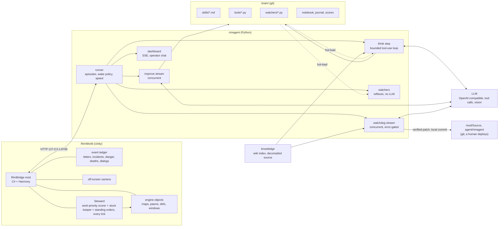
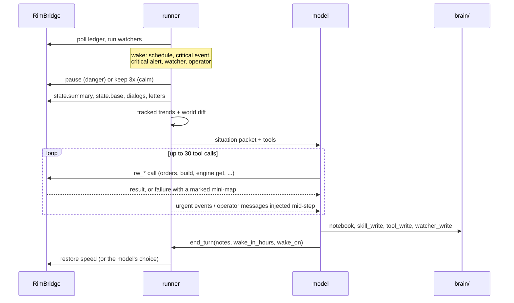
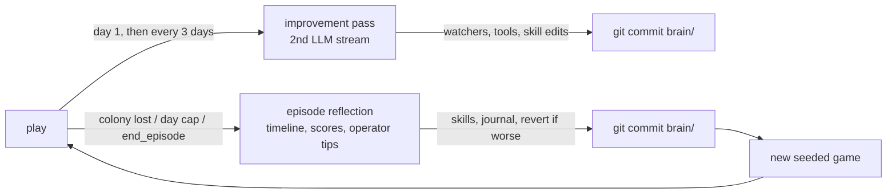
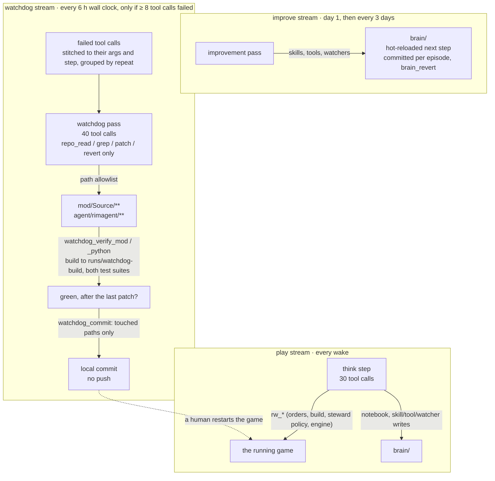

# rimagent

**An LLM that plays RimWorld and rewrites its own playbook between colonies.**

A local model (tested with Qwen 3 27–32B on vLLM) runs a RimWorld colony through a mod that exposes the whole engine over HTTP. It sees the world as objects, trends and diffs rather than pixels or grids, controls the game with the same verbs a player has (right-click orders, gizmos, designators, blueprints, zones, dialogs, trade), and keeps everything it learns on disk: **skills** (markdown), **tools** and **watchers** (Python, hot-loaded), a journal, and a score per episode. Every colony ends in a reflection that edits those files and commits them. Then it starts the next one.

<p align="center"><a href="docs/PAPER.md"><b>Read the paper</b></a> · <a href="https://github.com/zorrobyte/rimagent/releases/latest">Download the mod</a> · <a href="#quick-start">Quick start</a></p>

<p align="center"></p>

## What it looks like

| The base as the model sees it | Set-of-Mark screenshot (`look`) |
|---|---|
|  |  |

The *building camera*: every column is numbered, each building type gets its own letter (lowercase = blueprint), and `*` marks an interaction spot that must stay clear.

```
      111111111111111111111111111111111111
      334444444444555555555566666666667777
      890123456789012345678901234567890123
 123  ..AAAAAAA+AAAAAAAAAAAAAAAT..........
 121  ..A....T.JJ..KT.A..LLL..A...........
 120  ..A.....HJJH.*..+......T+...........
 118  ..A.............A..GGG..A...........
 116  iiAAAA+AAAAAA+AAAAAA+AAAA..FDD......
 115  ..A.C....A.C...TAi.T....A...DD....T.
 110  ..AAAAAAAAAAAAAAA.......A.........T.
 109  T........T......AABAAABAA.......T..T
```
`A` walls · `B` coolers (in the freezer wall) · `C` beds · `D` generator · `F` battery · `G` butcher table · `H` chairs · `J` table · `K` campfire · `L` stove · `+` doors

The compound above was laid out through the same tools the model uses, with named anchors instead of coordinates:

```
rw_anchor_set(name="hall", rect=[140,116,15,8])
rw_ui_build_many(ops=[
  {"def":"Door","stuff":"Steel","at":"hall:N"},
  {"def":"Cooler","at":"freezer:S +W2","rot":"N"},
  {"def":"Wall","stuff":"Steel","rect":"hall"},
  {"def":"Bed","stuff":"WoodLog","at":"bed1:inset:1:NW +E1 +S1","rot":"N"},
  {"def":"FueledStove","at":"kitchen:inset:2:NW +E2","rot":"S"}])
```

## How it works



One think step, from wake to sleep:



Between colonies:



Three LLM streams, three scopes. What each one may touch, and what gates it, is enforced in code rather than in the prompt:



The play and improve streams write `brain/`, which the harness reloads. The watchdog writes the project's own source and nothing it writes runs until a person deploys it.

**Perception (what a think step opens with):** tracked values with trends (`food_days 9→7→5 ↓`, add your own engine path with `watch_add`), a harness-computed diff of the world since the last step, the base as rooms/doors/contents/problems (`state.base`), events, alerts, letters, open dialogs, a Steward block (posture, one line per stock target such as `wood 420/500 ↑ forestry ok`, problems), then the raw numbers. Grids and pictures are on demand: `map.detail` (building camera), `map.view` (layers), `look` (screenshot with grid + numbered marks + anchor boxes).

**Control:** float-menu orders and gizmos (exactly what a player can click), designators, blueprints with a location grammar (`Campfire39256 +E2`, `@Gamble`, `bedroom2:NW`, `bedroom2:extend:E:4`, `Room:12`), zones/areas/storage, schedules, policies, bills, research, letters and every window type (rituals, trade, naming, message boxes; a generic reader/answerer for anything else). `engine.get/set/call` reach any live object by path for the rest; the decompiled source is searchable so the model can find the right API itself. Work priorities and resource gathering are not on this list on purpose: the Steward keeps them, and the model sets policy through `steward.*` (posture, targets, per-pawn exceptions) instead of micromanaging.

**Steward:** three automation layers inside RimBridge run every tick with no LLM in the loop: a work-priority scorer, a stock keeper, and standing orders. The *scorer* (a port of [Free Will](https://github.com/paul-freeman/rimworld-freewill) by Paul Freeman) recomputes each managed colonist's work priorities from skills, passions, injuries, food, fires and the current posture; the *stock keeper* (a synchronous rewrite of [Colony Manager Redux](https://github.com/ilyvion/colony-manager-redux) by ilyvion) keeps wood, forage, meat, leather and steel at targets by designating cut/harvest/hunt/mine, with safety, reachability and radius checks; a default plan scaled to colonist count is created on a new colony's first tick. The model sees the result in its situation packet and steers it with a dozen `rw_steward_*` tools: `status`, `explain` (why a pawn has a priority), `posture` (`defend`/`build`/`harvest`/`recover` or custom deltas, time-boxed), `stock_set`/`add`/`remove`/`run`, `pawn` (take one colonist manual), `settings`, `enable`. `ui.set_work` on a pawn takes that pawn out of steward management and says so. *Standing orders* are eight deterministic reflexes (combat draft to a rally point, rescue, unforbid, corpses, beds, policies, blueprints, fire), each toggleable and explainable through `rw_steward_orders*`, and a manual action on a pawn or thing pauses the matching order for it (the older brain watchers that drafted, rescued or unforbade from Python are skipped while the order that replaced them is on). The scorer and stock keeper are MIT; origins and modifications are listed in [THIRD_PARTY_NOTICES.md](THIRD_PARTY_NOTICES.md).

**Learning:** an improvement pass on a second LLM stream every few days (turn repeated reactions into watchers, repeated computations into tools, tighten skills with numbers), an episode reflection at the end, per-episode scores, git history of `brain/`, `brain_revert` when a change made things worse. Tips you type in the dashboard are folded into skills.

**Watchdog:** a third stream that does for the harness what the improvement pass does for the brain. The improvement pass stays inside `brain/`: text the harness hot-reloads, safe by construction. The watchdog reads the tool-call *error* stream instead of the game (each failed call stitched back to its arguments and the step it came from, identical failures grouped, because a failure that repeats across steps is a defect and one corrected on the next call is a guess) and patches the defects behind it in `mod/Source/**` and `agent/rimagent/**`: a bridge method that crashes on a legal input, a doc string the code contradicts, a helper whose signature cannot be called. It runs on its own thread when both gates pass, `every_hours` of wall clock and at least `min_errors` failures since the last pass (config `watchdog:`; a clean error stream fires nothing), never beside an improvement pass. Its guardrails are in the tools, not the prompt: a path allowlist (`safe_path` rejects `..`, absolute and symlink escapes, `.git`, build output, and everything outside the two trees, so `brain/`, `config.local.yaml`, `knowledge/` and `mod/1.6/` are unreachable, and so are the test suites it is judged by); an exact tool allowlist with no `run_python`, `rpc`, `rw_*` or brain tools (an unsandboxed exec with a bridge handle would make the path checks decorative), and a tool group the registry never offers to any other stream; and verify-before-commit tracked server-side, where a patch marks its root unverified and `watchdog_commit` refuses until `watchdog_verify_mod` (build plus mod tests) or `watchdog_verify_python` (pytest) has run, passed, and run after the last patch, then stages exactly the touched paths and never pushes. It never deploys: the verification build writes to `runs/watchdog-build/`, not the `mod/1.6/Assemblies/` symlink the running game loaded, the game is never restarted, and verified fixes are local commits that wait for a human at the next natural restart. Each pass appends to `brain/memory/watchdog_log.md` and shows in the dashboard's Watchdog tab.

**Knowledge:** the RimWorld wiki (scraped, BM25) and the decompiled game source (`search_source`, `read_source`). It reads the actual raid-point formula rather than guessing it.

## Quick start

Requirements: RimWorld 1.6 (tested on macOS/Steam with all DLCs), [Harmony](https://steamcommunity.com/sharedfiles/filedetails/?id=2009463077), .NET SDK 8+, [uv](https://docs.astral.sh/uv/), `rg` (ripgrep), and an OpenAI-compatible endpoint with native tool calls (vLLM: `--enable-auto-tool-choice --tool-call-parser hermes`; vision optional).

```bash
git clone https://github.com/zorrobyte/rimagent && cd rimagent
ln -s "$PWD/mod" "$HOME/Library/Application Support/Steam/steamapps/common/RimWorld/RimWorldMac.app/Mods/RimBridge"   # macOS path
script/build.sh                          # builds mod/1.6/Assemblies/RimBridge.dll
cd agent && uv sync && cd ..
cp config.yaml config.local.yaml         # put your llm.base_url / model in config.local.yaml
cd agent && uv run rimagent seed         # wiki → knowledge/wiki + BM25 (~10 min); decompile optional, see below
cd .. && script/start.sh                 # launches RimWorld via Steam if needed, starts the agent, opens the dashboard
```

Enable `RimBridge` in the mod list (after Harmony) the first time. The dashboard at http://127.0.0.1:8770 has tabs for Live (steps, the situation the model was shown, chat with the agent), Ledger, Watchers, Brain (skills, tools, watchers, memory, git history), Scores, Base, Steward (posture, stock rows, standing orders, rally point, toggles), Watchdog (its log and configuration), Map and ASCII.

Optional: decompile your own `Assembly-CSharp.dll` into `knowledge/source-1.6/` with [ilspycmd](https://github.com/icsharpcode/ILSpy) so the model can read the exact game code (`dotnet tool install -g ilspycmd; ilspycmd -p -o knowledge/source-1.6 <path to Assembly-CSharp.dll>`). Decompiled source is not part of this repo.

Useful commands: `rimagent think` (one step against the live game), `rimagent tools`, `rimagent llm "hi"`, `script/reload.sh` (save → restart game with a rebuilt mod → load → resume the agent), `curl localhost:8765/methods`.

## Repo layout

- `mod/`: RimBridge (C#). `Source/Engine` holds reflection and the location grammar, `State` the summaries and scene graph, `Map` the ASCII views, camera and screenshots, `Ui` the player-parity controls and dialogs, `Ledger` the Harmony event patches, `Steward` the vendored scorer and stock keeper plus their `steward.*` RPCs, `Dev` the training tools. `mod/Tests` (xunit) covers the pure parser and the stock threshold math.
- `agent/rimagent/`: runner, loop, registry (hot-loading tools and watchers), tracker, worlddiff, annotate (Set-of-Mark), reflect, skills/memory/scorecard, watchdog (the self-correction stream and its scoped repo tools), dashboard, knowledge (wiki and source), prompts.
- `brain/`: everything the agent authors. It starts with 13 seeded skills: the doctrine, the bridge manual, ten wiki-distilled strategy skills, and a worked base example.
- `docs/`: screenshots, the paper (`PAPER.md`) and release notes.

## Status

Early and very much alive: it loses colonies (fires, mech clusters, starvation), reflects, and comes back with new watchers and tighter skills. Cold-start play quality is not the point; the slope is. Contributions that make the *harness* see or act more faithfully are welcome; game strategy belongs in `brain/`, written by the agent.

## Paper

The design, the interface defects found by watching the agent play, and preliminary results from three colonies are written up in [docs/PAPER.md](docs/PAPER.md): *RimBridge and rimagent: A Player-Parity Interface and a Self-Editing Brain for Language-Model Agents in RimWorld* (preprint, September 2026). If you build on it:

```bibtex
@misc{rimagent2026,
  title  = {RimBridge and rimagent: A Player-Parity Interface and a Self-Editing Brain for Language-Model Agents in RimWorld},
  author = {zorrobyte},
  year   = {2026},
  url    = {https://github.com/zorrobyte/rimagent}
}
```

## License

MIT. RimWorld is © Ludeon Studios; this project is an unofficial mod + agent and ships no game assets.
