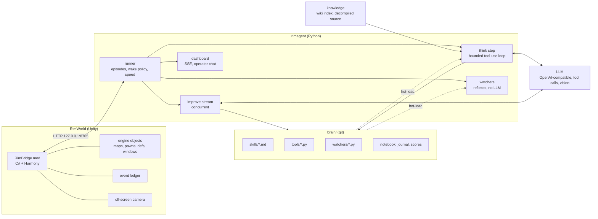
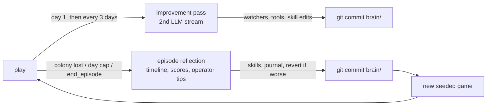

# RimBridge and rimagent: A Player-Parity Interface and a Self-Editing Brain for Language-Model Agents in RimWorld

**zorrobyte** (independent)

*Preprint, September 2026. Code, mod, prompts, and run logs: https://github.com/zorrobyte/rimagent*

## Abstract

Colony simulators are an attractive open-ended testbed for language-model (LLM) agents: long horizons, partial observability, spatial construction, an economy, combat, and a storyteller that escalates pressure over time. We present a complete system in which a locally served LLM (Qwen 3, 27B) plays RimWorld unattended and rewrites its own playbook between colonies. The system has two halves. **RimBridge** is a mod that exposes the running game over a loopback HTTP interface under a *player-parity* principle, everything a human can see, the agent can query; everything a human can click, the agent can call, together with reflective access to any live engine object and an event ledger. **rimagent** is the agent: a bounded tool-use loop whose observation is *change-first* (tracked trends, a harness-computed world diff, and the base as a scene graph rather than a grid), a wake policy that distinguishes calm from danger, and a persistent, git-versioned *brain* of markdown skills, hot-loaded Python tools and reflexes ("watchers"), and a cross-game journal that the agent edits in scheduled improvement passes and end-of-episode reflections. We describe the design, the sequence of interface defects that only surfaced by watching the agent play (pause semantics, modal dialogs, zero-work buildables, danger signalling), and preliminary results from three colonies: 281 think steps, 6,335 tool calls at a 10.8% tool-error rate, 13 tools and 14 watchers written by the agent, and a rising share of self-authored tool use (4.4% → 9.7%). We make no claim of strong play, both completed colonies were lost, but argue that the slope, not the intercept, is the object of study, and release everything to enable comparisons.

## 1 Introduction

Most LLM game-agent work fixes the environment interface in advance and studies the model. In practice, when a model plays a rich commercial game, the *interface* is where most of the failures live: the agent cannot see a modal dialog that has paused the game; a "crafting spot" that a player places instantly is exposed as a blueprint that can never complete; a manhunting rat is not a "raid" and raises no alarm; the agent counts columns on an ASCII grid and places a workbench with its interaction cell inside a wall. We built the interface iteratively against a live colony and treat those defects as findings.

The second theme is *self-editing*. Following Voyager's skill library [1] and reflection-style prompting, our agent's durable knowledge is a directory it can read and write: skills (markdown with frontmatter, selected by relevance), tools (Python functions that hot-load into its own tool list), watchers (fast reflexes that run every poll tick without the model), a colony notebook, and a cross-game journal. A runner commits this directory to git after every improvement pass and episode, so what was learned is a diff.

Contributions:

1. **RimBridge**, a player-parity bridge for RimWorld 1.6 (90 RPC methods, C#/Harmony) covering game control, structured state, map perception, the full player control surface including every window type, engine reflection over a path grammar, definitions, training/dev tools, and a Harmony-patched event ledger; plus an off-screen capture camera that renders any region without moving the player's view.
2. A **change-first, object-centric observation design**: tracked values with trends, a harness-computed world diff, a base scene graph (rooms, doors, contents, free floor, problems, trapped colonists), a location grammar with named anchors (`bedroom2:extend:E:4`), a numbered "building camera", failure feedback rendered as a marked mini-map, and Set-of-Mark screenshots [4] for the vision model.
3. A **wake and speed policy** that keeps the game at 3× through calm think steps, pauses only for danger, delivers urgent events *into* a running step, and lets the model's own speed choice persist.
4. A **self-improvement loop** with two LLM streams (play and improve), episode scoring, git history and revert, and a mechanism by which human tips typed on a dashboard are folded into skills rather than into a standing rulebook.
5. An honest **preliminary evaluation** and a catalogue of interface defects discovered by observation.

## 2 Related work

**Voyager** [1] established the pattern of an LLM agent in Minecraft with an ever-growing library of executable skills, an automatic curriculum, and self-verification; our tools/watchers are code skills in the same spirit, and our skills are their prose counterpart. The **Factorio Learning Environment** [2] is the closest analogue for construction on a grid: agents act through a typed Python API in a persistent REPL, and the authors report the same placement failures we observe ("placing entities too close or on top of each other, not leaving room for connections"); its lessons, typed returns, rich error messages, a persistent namespace, assertions, shaped our `run_python`, failure cameras and `dry_run` semantics. **SAGA** [3] replaces raw tiles with a map-semantic scene graph of per-entity distance/direction/threat statements and splits planning across domain controllers; `state.base` and our two-stream design follow that direction. Work on **spatial reasoning of LLM game agents** [5] finds models poor at absolute self-localization but adequate at relative reasoning and that multi-step planning horizons help most, which motivates our anchors, offsets and batched `build_many`. **Set-of-Mark prompting** [4] and grid/axis scaffolds for GUI agents motivate our annotated screenshots. **SAG-Agent** [6] maintains a state–action graph of experience with an object registry; our anchors are a minimal object registry the agent populates itself. Surveys of LLM game agents [7] discuss the symbolic-versus-visual observation trade-off we navigate by offering both and letting the model choose.

## 3 System

### 3.1 RimBridge

RimBridge is a Harmony mod that starts an `HttpListener` on `127.0.0.1:8765`. Every request is parsed on a worker thread and its Verse work is marshalled to the Unity main thread through a queue drained by a postfix on `Root.Update` (which runs in the menu and in play, paused or not), with a per-frame time budget; errors become JSON, never Unity exceptions. Method groups:

- `game.*`: seeded new games (a prefix on `Root_Play.SetupForQuickTestPlay` parameterises scenario, storyteller, difficulty, seed, map size), save/load, speed/pause, dev mode, `Player.log` tail.
- `state.*`: colony summary (wealth, nutrition/days, mood, threat points, alerts, power, key stocks, items outside storage with rot/deterioration counts, a room-size digest), pawns and full pawn detail, research, letters (with choices), quests, factions, rooms, bills, storage, designations, threats, **open dialogs**, and `state.base`, the scene graph (§3.2).
- `map.*`: layered ASCII views, a whole-map overview, the numbered *building camera*, `find` (by def/category/group/kind with distance sorting and reachability), `cell`, `reachable`, `path`, `open_rects`, `terrain_stats`, and PNG screenshots rendered by a second camera; a Harmony postfix on `CameraDriver.CurrentViewRect` widens the culled rect for one frame so off-screen sections are drawn.
- `ui.*`: the player's verbs: `orders_at`/`order` (the right-click float menu via `FloatMenuMakerMap.GetOptions`), `gizmos`/`press`, `designate` (any `Designator_*`), `build`/`build_many` (blueprints; zero-work things spawn instantly exactly as `Designator_Build` does), zones, areas, storage filters, work priorities, schedules, policies, research, bills, draft/goto/attack/job, letters, and `dialog`, which reads and answers every window: choice trees, message boxes, naming dialogs, rituals (roles and assignments), trade (quantities and prices), and a generic reflective reader/answerer for anything else (text fields, pawn lists, invokable actions and methods).
- `engine.*`: `get/set/call/new/members/types` over a path grammar (`Find.CurrentMap.mapPawns.FreeColonists[2].health`, `Thing:Human1234.needs.mood`, `Def:ThingDef:Steel`, `Type:RimWorld.GenConstruct.CanPlaceBlueprintAt`) with argument coercion (cells, things, defs, enums, ranges), extension-method resolution, a denylist, and close-match suggestions on unknown members.
- `defs.*`, `dev.*` (spawn, incidents, god mode, heal; every call marks the run *assisted*), `anchor.*` (named places saved in the game).
- **Ledger**: Harmony postfixes on letters, messages, incidents, deaths, downed, mental breaks (including manhunter animals), research, construction completion/failure, building loss, quests, hostile lords, faction changes, window opening, plus a `danger` transition event from `DangerWatcher` and a daily snapshot; served as `/events?since=`.
- **Steward** (`steward.*`): an automation layer below the model. Two open-source colony-automation mods are vendored into RimBridge and run every tick without the LLM: a port of Free Will's work-priority scorer, which recomputes each managed colonist's priorities from skills, passions, injuries, food state, fires and a colony-wide *posture*, and a synchronous rewrite of Colony Manager Redux's threshold stock jobs (forestry, foraging, hunting, mining, production, livestock), which designate work until counted stock meets a target, with safety, reachability and radius checks and a default plan scaled to colonist count. The model sets policy rather than chores: `steward.posture` (time-boxed deltas such as `defend` or `build`), `steward.stock.set` (targets, suspension, allowed defs), `steward.explain` (the scored reasons behind a pawn's priorities), and `steward.pawn` to take a single colonist manual; `ui.set_work` on a managed pawn unmanages it and says so, so the model cannot be silently overruled. The situation packet carries a compact Steward block and the ledger gains `stock_stalled`, `stock_reached` and `posture_expired`. This moves the altitude ladder up one rung (posture/targets → orders and gizmos → designators/blueprints/zones → direct jobs → engine) and removes the two largest sources of per-step micromanagement observed in earlier colonies. A second pass adds *standing orders* (`steward.orders.*`): eight deterministic reflexes in the mod (combat draft to a model-chosen rally point, rescue, unforbid, corpses, beds, policies, blueprints, fire), each toggleable and explainable, where any manual action on a pawn or thing pauses the matching order for that target, so the model overrides by acting rather than by disabling.

*Figure: system overview. The mod exposes the engine; the runner decides when the model thinks; the brain directory is what the model edits and what the runner commits.*

### 3.2 Perception

Every think step is a fresh, bounded conversation. Its user message opens with the parts most likely to change a decision:

1. **Tracked values.** The agent (or a default set) names engine paths; the harness samples them each step and prints the last five values with a trend arrow (`food_days 0.9→0.6→0.7→0.3→0.0 ↓`).
2. **What changed.** A harness-computed diff of a snapshot taken last step: numbers that moved beyond 5%, rooms that appeared, changed size, gained or lost problems, furniture that ended up outside any enclosed room, mood/health swings, colonists joined/lost, trapped colonists.
3. **Open dialogs**, then events since the last step, watcher alerts, game alerts and letters.
4. **The base as objects.** `state.base` lists each enclosed room with a `Room:<id>` reference, role, size, free floor, doors and what they lead to, contents (with interaction cells in verbose mode), problems (unroofed, no door, dark, cold, no free floor), structures outside rooms, anchors, and colonists who can reach neither home nor the map edge.
5. Colonists and the raw summary, last.

Grids are on demand. The *building camera* (`map.detail`, up to 60×60) numbers every column across three header rows, assigns one letter per building type (lowercase for blueprints/frames), marks interaction spots with `*`, and returns the things in view with id, rotation, size and interaction cell. A failed `build` returns a 13×13 camera with the failed cells marked `X` and the engine's reason. `look` returns a screenshot with a labelled 5-cell grid, anchor boxes, and numbered marks on furniture and standalone buildings with a number→id table (Set-of-Mark). `run_python` is a persistent REPL with pre-bound helpers so references survive across steps.

**Locations are names.** Everywhere a cell or rect is accepted, the grammar allows `Campfire39256 +E2 +N1`, `@Gamble`, `bedroom2`, `bedroom2:NW`, `bedroom2:inset:1`, `bedroom2:extend:E:4`, `Room:12`, and `home`. Anchors are set by the agent (`anchor.set`) and are saved with the game.

### 3.3 Control loop and wake policy

The runner polls the ledger twice a second and runs watchers on the new events. A step is triggered by: a critical event kind (dialog, danger transition, manhunter, hostile group, downed/dead colonist, mental break, building lost), a watcher alert, a new Critical-priority game alert (or any "idle colonist" alert, each label at most once per 24 in-game hours), an operator message, or the scheduled wake the model asked for at the end of its previous step (floored at 8 in-game hours in calm, 30 minutes when the step was urgent). Calm steps run with the game at 3×; urgent steps pause it. Critical events and operator messages arriving *during* a step are injected after the next tool call, with the game paused. A speed the model sets during a step (e.g., 1× for a raid) persists after it. Steps are capped at 30 tool calls and end when the model calls `end_turn(notes, wake_in_hours, wake_on)`; narration without a tool call is nudged twice before being accepted.

### 3.4 Self-improvement

The brain directory holds skills (markdown with `name`, `description`, `tags`, `always`; always-on skills are the operator's manual and the doctrine, the rest are selected by BM25 against the situation), tools and watchers (Python files hot-loaded on modification; load and runtime errors are shown to the model, and a failing watcher is disabled until edited), a colony notebook, a cross-game journal, and `scores.jsonl`. An **improvement pass** runs on a second LLM stream at day 1 and then every 3 days, concurrent with play, with the instruction to turn repeated reactions into watchers, repeated computations into tools, and lessons into skills with numbers. An **episode reflection** runs when a colony is lost, the day cap is reached, or the model declares it over, with a compressed timeline, the notebook, the score table with the brain commit each episode ran on, and the operator tips received; it edits the brain and writes a journal entry. The runner commits `brain/` after each pass; `brain_revert(sha)` restores an earlier state as a new commit.

*Figure: the learning loop. Every brain change is a commit, so what was learned per episode is a diff.*

Human input is a chat box on the dashboard. A message wakes the agent (or lands mid-step), must be answered with `reply_to_operator`, and, if it is a tip, must be folded into the most relevant skill immediately; reflection re-checks that every tip landed in a skill. There is deliberately no standing-instruction block in the prompt: the goal is that guidance becomes learned play, not a rulebook.

### 3.5 Knowledge grounding

The agent can search an offline copy of the RimWorld wiki (2,970 articles, BM25 over ~11k chunks) and grep the decompiled game source of the exact installed build (9,213 files), then read ranges of it. The latter is what makes `engine.call` usable in practice: the model finds `Designator_Build` or `StorytellerUtility.DefaultThreatPointsNow` and calls what it read. Twelve starter skills were seeded before the first game: a doctrine, the bridge manual, and ten strategy skills distilled from the wiki. (The decompiled source is not distributed with the code.)

## 4 Preliminary results

Setting: RimWorld 1.6.4871 with all expansions, macOS/Steam, Crashlanded scenario, Cassandra storyteller at "Strive to survive", fixed seed pool; Qwen 3 27B (NVFP4, speculative decoding) served by vLLM with thinking enabled and native tool calls; 60-day episode cap. Everything below is from the logged runs in one session; harness changes were being made concurrently, so this is a development log, not a controlled experiment.

**Activity.** 281 think steps (268 play, 13 improve), 6,335 tool calls, median 24 calls and 80 s per step. Triggers: alerts 74, ledger events 63, scheduled 45, watcher alerts 34, restarts 23, improvement passes 19, operator messages 15. Most-used tools: `map_find` 812, `state_pawn` 397, `ui_set_work` 307, `ui_designate` 284, `ui_build` 243, `ui_order` 223, `ui_set_policies` 190, `map_detail` 158, and the agent-authored `crop_status` 138. 686 tool calls (10.8%) returned an error; the rate fell from 32% in the very first step, to 11.3% in episode 1, 8.5% in episode 2 and 9.2% in episode 3. Errors are dominated by guessed identifiers (`Gun_BoltAction`, `CookStove`) and engine-path probing, which the bridge answers with "similar members" and "try defs.search".

**Self-authoring.** The agent wrote 13 tools (e.g., `crop_status`, `colony_health`, `blueprint_check`, `mood_triage`, `check_degradation`, `refugee_intake`) and 14 watchers (`hostile_draft`, `rescue_downed`, `fire_alert`, `food_crisis_watcher`, `undraft_after_fight`, `rat_threat`, `unforbid_drops_watcher`, …), edited skills 17 times, appended 15 journal entries, and produced 49 brain commits. The share of tool calls that went to its own tools rose from 4.4% (episode 1) to 4.7% (episode 2) to 9.7% (episode 3). Journal entries are specific and mostly correct: "Furniture needs a free interaction cell next to fires/stoves", "Stockpiles need roofs or items degrade", "Confined interior (−10) is a real break trigger; bedrooms need ≥25 tiles", "Batteries must be roofed", "Wood walls are a fire death sentence", "Drafted pawns cannot fight fires", "Sleeping mechs are a countdown, not a raid, build defenses in the window", "Spike traps: colonists trigger their own traps", "Food policy table verified from source (FoodRestrictionDatabase.cs)".

**Outcomes.** Episode 1 (26 days) was lost to a fire in a wooden base: one colonist burned, a refugee left, and the last colonist was downed with untreated burns. Episode 2 (4 days, desert) was declared lost by the agent when two sleeping mechanoids near a two-colonist base were judged unwinnable. Episode 3 is in progress (day 12, three colonists). Scores (a simple linear function of days, colonists, deaths, wealth, mood, research and raids survived): 148 and 78.

**Human-in-the-loop.** 23 operator messages received 28 replies; a tip about roofed stockpiles produced a skill edit, a new `check_degradation` tool and a journal entry within one step. A compound (hall, two bedrooms, kitchen, freezer, generator) laid out by the human through the agent's own tools, with anchors and no literal coordinates after the initial rects, was built by the colonists in ~9 in-game days and then written up as a worked-example skill.

**Interface defects found by watching.** In order of discovery: (i) pausing to think looked frozen to a human and starved play time; (ii) construction-failure rolls masqueraded as building losses and woke the agent; (iii) modal dialogs (research complete, monolith, faction naming, ritual, trade) paused the game invisibly; (iv) zero-work buildables (crafting/butcher spots) exposed as blueprints could never succeed (`0.925^(work/0)`); (v) a single manhunting animal created no hostile group and hence no alarm, replaced by `DangerWatcher` transitions; (vi) models pass JSON as strings (`"[97, 98]"`) and alias parameter names (`content` for `text`); (vii) a hung LLM socket with a 15-minute timeout froze play for half an hour; (viii) the scoreboard under-counted days after agent restarts. Each became a harness rule rather than a prompt instruction.

## 5 Discussion and limitations

This is a systems report with a development-time log, not a benchmark result. There is no baseline (no ablation of the diff, anchors, or watchers), one model, one map generator, three episodes, and the harness changed under the agent throughout. Scores are not comparable across episodes for that reason. Both finished colonies were lost, and the losses were classic beginner mistakes, wooden walls near a campfire, hunting far from home, no plan for mechanoids, that the agent then wrote down. Whether written-down lessons translate into avoided repeats is exactly the question the release is meant to let others test.

Some design choices deserve scrutiny. Anchors and the location grammar remove coordinate arithmetic, but the model still has to *choose* good sites; our observation is that it does so more readily when the site is a named object than a number pair. The change-first packet shrinks reads (the first 118-call session spent 23 calls on `map_find`), but the median step still uses 24 calls, mostly reads; an obvious next step is caching. Two streams are a pragmatic use of a 4-stream server; SAGA's domain controllers suggest going further. The generic window reader guarantees no black boxes, but its "methods you could call" list is heuristic. The `assisted` flag separates curriculum runs from honest ones only at episode granularity.

## 6 Future work

Controlled comparisons (fixed harness, fixed seeds, N episodes per condition) for: change-first vs snapshot packets, anchors vs coordinates, watchers on/off, and improvement passes on/off; a held-out map test of transferred skills; caching and delta reads; a defense controller on its own stream during raids; caravans and world-map play; multiple models, including the vision-heavy path where Set-of-Mark screenshots replace the ASCII camera.

## 7 Conclusion

Most of what an LLM needs to play a rich game well is not in the model; it is in whether the interface tells it the game is paused, shows it the door it walled shut, and lets it say "against the north wall of the barracks". We built that interface and a brain the agent maintains itself, watched it lose two colonies, and released the whole thing so the slope can be measured properly.

## References

[1] G. Wang et al. *Voyager: An Open-Ended Embodied Agent with Large Language Models.* arXiv:2305.16291, 2023.
[2] J. Hopkins et al. *Factorio Learning Environment.* arXiv:2503.09617, 2025.
[3] *SAGA: Scene-Aware, Goal-Evolving Agents for Long-Horizon CivRealm Strategy Planning.* arXiv:2606.29932, 2026.
[4] J. Yang et al. *Set-of-Mark Prompting Unleashes Extraordinary Visual Grounding in GPT-4V.* arXiv:2310.11441, 2023.
[5] *Spatial Reasoning in LLM Game Agents: Impact of Causal Context and Multi-Step Planning.* arXiv:2607.22732, 2026.
[6] *SAG-Agent: Enabling Long-Horizon Reasoning in Strategy Games via Dynamic Knowledge Graphs.* arXiv:2510.15259, 2025.
[7] S. Hu et al. *A Survey on Large Language Model-Based Game Agents.* arXiv:2404.02039, 2024.

## Appendix A: Reproducibility

Code: https://github.com/zorrobyte/rimagent (MIT). The mod is released as a drop-in folder. `config.local.yaml` points at any OpenAI-compatible endpoint with native tool calls. `rimagent seed` builds the wiki index; the decompiled source is produced locally with ilspycmd and never redistributed. Run logs are JSONL event streams (`runs/`), one event per think-step element, from which all numbers above were computed with the script in this repository's history.

## Appendix B: Prompt sketch

System: identity and protocol (act with tools; end with `end_turn`; reply to the operator; learn tips into skills), always-on skills (doctrine, bridge manual), skill index, relevance-selected skills, notebook, recent journal, score table, brain load errors. User: wake trigger → open dialogs → tracked values → what changed → events → watcher alerts → game alerts → letters → base as objects → colonists → colony numbers → "Act now."
