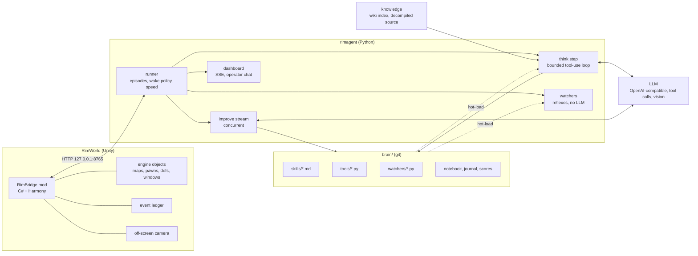
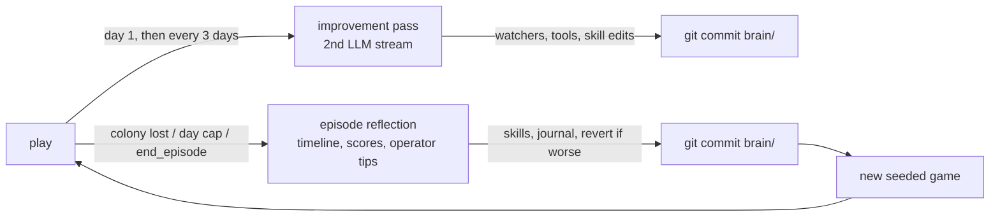
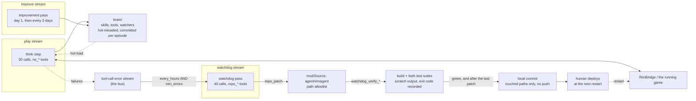

# RimBridge and rimagent: A Player-Parity Interface and a Self-Editing Brain for Language-Model Agents in RimWorld

**zorrobyte** (independent)

*Preprint, September 2026. Code, mod, prompts, and run logs: https://github.com/zorrobyte/rimagent*

*Revision history: v1, 16 September 2026 (tag `v0.1.0`). v2, 16 September 2026: adds the Steward and standing orders, an automation layer inside the mod that moves the model from per-pawn micromanagement to colony direction, and the watchdog, a second self-correction stream that patches the project's own source under hard guardrails; §3.1 gains the `steward.*` method group and §8 is the changelog entry. Sections 1 to 7 are unchanged from v1.*

## Abstract

Colony simulators are an attractive open-ended testbed for language-model (LLM) agents: long horizons, partial observability, spatial construction, an economy, combat, and a storyteller that escalates pressure over time. We present a complete system in which a locally served LLM (Qwen 3, 27B) plays RimWorld unattended and rewrites its own playbook between colonies. The system has two halves. **RimBridge** is a mod that exposes the running game over a loopback HTTP interface under a *player-parity* principle, everything a human can see, the agent can query; everything a human can click, the agent can call, together with reflective access to any live engine object and an event ledger. **rimagent** is the agent: a bounded tool-use loop whose observation is *change-first* (tracked trends, a harness-computed world diff, and the base as a scene graph rather than a grid), a wake policy that distinguishes calm from danger, and a persistent, git-versioned *brain* of markdown skills, hot-loaded Python tools and reflexes ("watchers"), and a cross-game journal that the agent edits in scheduled improvement passes and end-of-episode reflections. We describe the design, the sequence of interface defects that only surfaced by watching the agent play (pause semantics, modal dialogs, zero-work buildables, danger signalling), and preliminary results from three colonies: 281 think steps, 6,335 tool calls at a 10.8% tool-error rate, 13 tools and 14 watchers written by the agent, and a rising share of self-authored tool use (4.4% → 9.7%). We make no claim of strong play, both completed colonies were lost, but argue that the slope, not the intercept, is the object of study, and release everything to enable comparisons.

## 1 Introduction

Most LLM game-agent work fixes the environment interface in advance and studies the model. In practice, when a model plays a rich commercial game, the *interface* is where most of the failures live: the agent cannot see a modal dialog that has paused the game; a "crafting spot" that a player places instantly is exposed as a blueprint that can never complete; a manhunting rat is not a "raid" and raises no alarm; the agent counts columns on an ASCII grid and places a workbench with its interaction cell inside a wall. We built the interface iteratively against a live colony and treat those defects as findings.

The second theme is *self-editing*. Following Voyager's skill library [1] and reflection-style prompting, our agent's durable knowledge is a directory it can read and write: skills (markdown with frontmatter, selected by relevance), tools (Python functions that hot-load into its own tool list), watchers (fast reflexes that run every poll tick without the model), a colony notebook, and a cross-game journal. A runner commits this directory to git after every improvement pass and episode, so what was learned is a diff.

Contributions:

1. **RimBridge**, a player-parity bridge for RimWorld 1.6 (90 RPC methods, C#/Harmony) covering game control, structured state, map perception, the full player control surface including every window type, engine reflection over a path grammar, definitions, training/dev tools, and a Harmony-patched event ledger; plus an off-screen capture camera that renders any region without moving the player's view.
2. A **change-first, object-centric observation design**: tracked values with trends, a harness-computed world diff, a base scene graph (rooms, doors, contents, free floor, problems, trapped colonists), a location grammar with named anchors (`bedroom2:extend:E:4`), a numbered "building camera", failure feedback rendered as a marked mini-map, and Set-of-Mark screenshots [4] for the vision model.
3. A **wake and speed policy** that keeps the game at 3× through calm think steps, pauses only for danger, delivers urgent events *into* a running step, and lets the model's own speed choice persist.
4. A **self-improvement loop** with two LLM streams (play and improve), episode scoring, git history and revert, and a mechanism by which human tips typed on a dashboard are folded into skills rather than into a standing rulebook.
5. An honest **preliminary evaluation** and a catalogue of interface defects discovered by observation.

## 2 Related work

**Voyager** [1] established the pattern of an LLM agent in Minecraft with an ever-growing library of executable skills, an automatic curriculum, and self-verification; our tools/watchers are code skills in the same spirit, and our skills are their prose counterpart. The **Factorio Learning Environment** [2] is the closest analogue for construction on a grid: agents act through a typed Python API in a persistent REPL, and the authors report the same placement failures we observe ("placing entities too close or on top of each other, not leaving room for connections"); its lessons, typed returns, rich error messages, a persistent namespace, assertions, shaped our `run_python`, failure cameras and `dry_run` semantics. **SAGA** [3] replaces raw tiles with a map-semantic scene graph of per-entity distance/direction/threat statements and splits planning across domain controllers; `state.base` and our two-stream design follow that direction. Work on **spatial reasoning of LLM game agents** [5] finds models poor at absolute self-localization but adequate at relative reasoning and that multi-step planning horizons help most, which motivates our anchors, offsets and batched `build_many`. **Set-of-Mark prompting** [4] and grid/axis scaffolds for GUI agents motivate our annotated screenshots. **SAG-Agent** [6] maintains a state–action graph of experience with an object registry; our anchors are a minimal object registry the agent populates itself. Surveys of LLM game agents [7] discuss the symbolic-versus-visual observation trade-off we navigate by offering both and letting the model choose.

## 3 System

### 3.1 RimBridge

RimBridge is a Harmony mod that starts an `HttpListener` on `127.0.0.1:8765`. Every request is parsed on a worker thread and its Verse work is marshalled to the Unity main thread through a queue drained by a postfix on `Root.Update` (which runs in the menu and in play, paused or not), with a per-frame time budget; errors become JSON, never Unity exceptions. Method groups:

- `game.*`: seeded new games (a prefix on `Root_Play.SetupForQuickTestPlay` parameterises scenario, storyteller, difficulty, seed, map size), save/load, speed/pause, dev mode, `Player.log` tail.
- `state.*`: colony summary (wealth, nutrition/days, mood, threat points, alerts, power, key stocks, items outside storage with rot/deterioration counts, a room-size digest), pawns and full pawn detail, research, letters (with choices), quests, factions, rooms, bills, storage, designations, threats, **open dialogs**, and `state.base`, the scene graph (§3.2).
- `map.*`: layered ASCII views, a whole-map overview, the numbered *building camera*, `find` (by def/category/group/kind with distance sorting and reachability), `cell`, `reachable`, `path`, `open_rects`, `terrain_stats`, and PNG screenshots rendered by a second camera; a Harmony postfix on `CameraDriver.CurrentViewRect` widens the culled rect for one frame so off-screen sections are drawn.
- `ui.*`: the player's verbs: `orders_at`/`order` (the right-click float menu via `FloatMenuMakerMap.GetOptions`), `gizmos`/`press`, `designate` (any `Designator_*`), `build`/`build_many` (blueprints; zero-work things spawn instantly exactly as `Designator_Build` does), zones, areas, storage filters, work priorities, schedules, policies, research, bills, draft/goto/attack/job, letters, and `dialog`, which reads and answers every window: choice trees, message boxes, naming dialogs, rituals (roles and assignments), trade (quantities and prices), and a generic reflective reader/answerer for anything else (text fields, pawn lists, invokable actions and methods).
- `engine.*`: `get/set/call/new/members/types` over a path grammar (`Find.CurrentMap.mapPawns.FreeColonists[2].health`, `Thing:Human1234.needs.mood`, `Def:ThingDef:Steel`, `Type:RimWorld.GenConstruct.CanPlaceBlueprintAt`) with argument coercion (cells, things, defs, enums, ranges), extension-method resolution, a denylist, and close-match suggestions on unknown members.
- `defs.*`, `dev.*` (spawn, incidents, god mode, heal; every call marks the run *assisted*), `anchor.*` (named places saved in the game).
- **Ledger**: Harmony postfixes on letters, messages, incidents, deaths, downed, mental breaks (including manhunter animals), research, construction completion/failure, building loss, quests, hostile lords, faction changes, window opening, plus a `danger` transition event from `DangerWatcher` and a daily snapshot; served as `/events?since=`.
- **Steward** (`steward.*`): an automation layer below the model. Two open-source colony-automation mods are vendored into RimBridge and run every tick without the LLM: a port of Free Will's work-priority scorer, which recomputes each managed colonist's priorities from skills, passions, injuries, food state, fires and a colony-wide *posture*, and a synchronous rewrite of Colony Manager Redux's threshold stock jobs (forestry, foraging, hunting, mining, production, livestock), which designate work until counted stock meets a target, with safety, reachability and radius checks and a default plan scaled to colonist count. The model sets policy rather than chores: `steward.posture` (time-boxed deltas such as `defend` or `build`), `steward.stock.set` (targets, suspension, allowed defs), `steward.explain` (the scored reasons behind a pawn's priorities), and `steward.pawn` to take a single colonist manual; `ui.set_work` on a managed pawn unmanages it and says so, so the model cannot be silently overruled. The situation packet carries a compact Steward block and the ledger gains `stock_stalled`, `stock_reached` and `posture_expired`. This moves the altitude ladder up one rung (posture/targets → orders and gizmos → designators/blueprints/zones → direct jobs → engine) and removes the two largest sources of per-step micromanagement observed in earlier colonies. A second pass adds *standing orders* (`steward.orders.*`): eight deterministic reflexes in the mod (combat draft to a model-chosen rally point, rescue, unforbid, corpses, beds, policies, blueprints, fire), each toggleable and explainable, where any manual action on a pawn or thing pauses the matching order for that target, so the model overrides by acting rather than by disabling.

*Figure: system overview. The mod exposes the engine; the runner decides when the model thinks; the brain directory is what the model edits and what the runner commits.*

### 3.2 Perception

Every think step is a fresh, bounded conversation. Its user message opens with the parts most likely to change a decision:

1. **Tracked values.** The agent (or a default set) names engine paths; the harness samples them each step and prints the last five values with a trend arrow (`food_days 0.9→0.6→0.7→0.3→0.0 ↓`).
2. **What changed.** A harness-computed diff of a snapshot taken last step: numbers that moved beyond 5%, rooms that appeared, changed size, gained or lost problems, furniture that ended up outside any enclosed room, mood/health swings, colonists joined/lost, trapped colonists.
3. **Open dialogs**, then events since the last step, watcher alerts, game alerts and letters.
4. **The base as objects.** `state.base` lists each enclosed room with a `Room:<id>` reference, role, size, free floor, doors and what they lead to, contents (with interaction cells in verbose mode), problems (unroofed, no door, dark, cold, no free floor), structures outside rooms, anchors, and colonists who can reach neither home nor the map edge.
5. Colonists and the raw summary, last.

Grids are on demand. The *building camera* (`map.detail`, up to 60×60) numbers every column across three header rows, assigns one letter per building type (lowercase for blueprints/frames), marks interaction spots with `*`, and returns the things in view with id, rotation, size and interaction cell. A failed `build` returns a 13×13 camera with the failed cells marked `X` and the engine's reason. `look` returns a screenshot with a labelled 5-cell grid, anchor boxes, and numbered marks on furniture and standalone buildings with a number→id table (Set-of-Mark). `run_python` is a persistent REPL with pre-bound helpers so references survive across steps.

**Locations are names.** Everywhere a cell or rect is accepted, the grammar allows `Campfire39256 +E2 +N1`, `@Gamble`, `bedroom2`, `bedroom2:NW`, `bedroom2:inset:1`, `bedroom2:extend:E:4`, `Room:12`, and `home`. Anchors are set by the agent (`anchor.set`) and are saved with the game.

### 3.3 Control loop and wake policy

The runner polls the ledger twice a second and runs watchers on the new events. A step is triggered by: a critical event kind (dialog, danger transition, manhunter, hostile group, downed/dead colonist, mental break, building lost), a watcher alert, a new Critical-priority game alert (or any "idle colonist" alert, each label at most once per 24 in-game hours), an operator message, or the scheduled wake the model asked for at the end of its previous step (floored at 8 in-game hours in calm, 30 minutes when the step was urgent). Calm steps run with the game at 3×; urgent steps pause it. Critical events and operator messages arriving *during* a step are injected after the next tool call, with the game paused. A speed the model sets during a step (e.g., 1× for a raid) persists after it. Steps are capped at 30 tool calls and end when the model calls `end_turn(notes, wake_in_hours, wake_on)`; narration without a tool call is nudged twice before being accepted.

### 3.4 Self-improvement

The brain directory holds skills (markdown with `name`, `description`, `tags`, `always`; always-on skills are the operator's manual and the doctrine, the rest are selected by BM25 against the situation), tools and watchers (Python files hot-loaded on modification; load and runtime errors are shown to the model, and a failing watcher is disabled until edited), a colony notebook, a cross-game journal, and `scores.jsonl`. An **improvement pass** runs on a second LLM stream at day 1 and then every 3 days, concurrent with play, with the instruction to turn repeated reactions into watchers, repeated computations into tools, and lessons into skills with numbers. An **episode reflection** runs when a colony is lost, the day cap is reached, or the model declares it over, with a compressed timeline, the notebook, the score table with the brain commit each episode ran on, and the operator tips received; it edits the brain and writes a journal entry. The runner commits `brain/` after each pass; `brain_revert(sha)` restores an earlier state as a new commit.

*Figure: the learning loop. Every brain change is a commit, so what was learned per episode is a diff.*

Human input is a chat box on the dashboard. A message wakes the agent (or lands mid-step), must be answered with `reply_to_operator`, and, if it is a tip, must be folded into the most relevant skill immediately; reflection re-checks that every tip landed in a skill. There is deliberately no standing-instruction block in the prompt: the goal is that guidance becomes learned play, not a rulebook.

### 3.5 Knowledge grounding

The agent can search an offline copy of the RimWorld wiki (2,970 articles, BM25 over ~11k chunks) and grep the decompiled game source of the exact installed build (9,213 files), then read ranges of it. The latter is what makes `engine.call` usable in practice: the model finds `Designator_Build` or `StorytellerUtility.DefaultThreatPointsNow` and calls what it read. Twelve starter skills were seeded before the first game: a doctrine, the bridge manual, and ten strategy skills distilled from the wiki. (The decompiled source is not distributed with the code.)

## 4 Preliminary results

Setting: RimWorld 1.6.4871 with all expansions, macOS/Steam, Crashlanded scenario, Cassandra storyteller at "Strive to survive", fixed seed pool; Qwen 3 27B (NVFP4, speculative decoding) served by vLLM with thinking enabled and native tool calls; 60-day episode cap. Everything below is from the logged runs in one session; harness changes were being made concurrently, so this is a development log, not a controlled experiment.

**Activity.** 281 think steps (268 play, 13 improve), 6,335 tool calls, median 24 calls and 80 s per step. Triggers: alerts 74, ledger events 63, scheduled 45, watcher alerts 34, restarts 23, improvement passes 19, operator messages 15. Most-used tools: `map_find` 812, `state_pawn` 397, `ui_set_work` 307, `ui_designate` 284, `ui_build` 243, `ui_order` 223, `ui_set_policies` 190, `map_detail` 158, and the agent-authored `crop_status` 138. 686 tool calls (10.8%) returned an error; the rate fell from 32% in the very first step, to 11.3% in episode 1, 8.5% in episode 2 and 9.2% in episode 3. Errors are dominated by guessed identifiers (`Gun_BoltAction`, `CookStove`) and engine-path probing, which the bridge answers with "similar members" and "try defs.search".

**Self-authoring.** The agent wrote 13 tools (e.g., `crop_status`, `colony_health`, `blueprint_check`, `mood_triage`, `check_degradation`, `refugee_intake`) and 14 watchers (`hostile_draft`, `rescue_downed`, `fire_alert`, `food_crisis_watcher`, `undraft_after_fight`, `rat_threat`, `unforbid_drops_watcher`, …), edited skills 17 times, appended 15 journal entries, and produced 49 brain commits. The share of tool calls that went to its own tools rose from 4.4% (episode 1) to 4.7% (episode 2) to 9.7% (episode 3). Journal entries are specific and mostly correct: "Furniture needs a free interaction cell next to fires/stoves", "Stockpiles need roofs or items degrade", "Confined interior (−10) is a real break trigger; bedrooms need ≥25 tiles", "Batteries must be roofed", "Wood walls are a fire death sentence", "Drafted pawns cannot fight fires", "Sleeping mechs are a countdown, not a raid, build defenses in the window", "Spike traps: colonists trigger their own traps", "Food policy table verified from source (FoodRestrictionDatabase.cs)".

**Outcomes.** Episode 1 (26 days) was lost to a fire in a wooden base: one colonist burned, a refugee left, and the last colonist was downed with untreated burns. Episode 2 (4 days, desert) was declared lost by the agent when two sleeping mechanoids near a two-colonist base were judged unwinnable. Episode 3 is in progress (day 12, three colonists). Scores (a simple linear function of days, colonists, deaths, wealth, mood, research and raids survived): 148 and 78.

**Human-in-the-loop.** 23 operator messages received 28 replies; a tip about roofed stockpiles produced a skill edit, a new `check_degradation` tool and a journal entry within one step. A compound (hall, two bedrooms, kitchen, freezer, generator) laid out by the human through the agent's own tools, with anchors and no literal coordinates after the initial rects, was built by the colonists in ~9 in-game days and then written up as a worked-example skill.

**Interface defects found by watching.** In order of discovery: (i) pausing to think looked frozen to a human and starved play time; (ii) construction-failure rolls masqueraded as building losses and woke the agent; (iii) modal dialogs (research complete, monolith, faction naming, ritual, trade) paused the game invisibly; (iv) zero-work buildables (crafting/butcher spots) exposed as blueprints could never succeed (`0.925^(work/0)`); (v) a single manhunting animal created no hostile group and hence no alarm, replaced by `DangerWatcher` transitions; (vi) models pass JSON as strings (`"[97, 98]"`) and alias parameter names (`content` for `text`); (vii) a hung LLM socket with a 15-minute timeout froze play for half an hour; (viii) the scoreboard under-counted days after agent restarts. Each became a harness rule rather than a prompt instruction.

## 5 Discussion and limitations

This is a systems report with a development-time log, not a benchmark result. There is no baseline (no ablation of the diff, anchors, or watchers), one model, one map generator, three episodes, and the harness changed under the agent throughout. Scores are not comparable across episodes for that reason. Both finished colonies were lost, and the losses were classic beginner mistakes, wooden walls near a campfire, hunting far from home, no plan for mechanoids, that the agent then wrote down. Whether written-down lessons translate into avoided repeats is exactly the question the release is meant to let others test.

Some design choices deserve scrutiny. Anchors and the location grammar remove coordinate arithmetic, but the model still has to *choose* good sites; our observation is that it does so more readily when the site is a named object than a number pair. The change-first packet shrinks reads (the first 118-call session spent 23 calls on `map_find`), but the median step still uses 24 calls, mostly reads; an obvious next step is caching. Two streams are a pragmatic use of a 4-stream server; SAGA's domain controllers suggest going further. The generic window reader guarantees no black boxes, but its "methods you could call" list is heuristic. The `assisted` flag separates curriculum runs from honest ones only at episode granularity.

## 6 Future work

Controlled comparisons (fixed harness, fixed seeds, N episodes per condition) for: change-first vs snapshot packets, anchors vs coordinates, watchers on/off, and improvement passes on/off; a held-out map test of transferred skills; caching and delta reads; a defense controller on its own stream during raids; caravans and world-map play; multiple models, including the vision-heavy path where Set-of-Mark screenshots replace the ASCII camera.

## 7 Conclusion

Most of what an LLM needs to play a rich game well is not in the model; it is in whether the interface tells it the game is paused, shows it the door it walled shut, and lets it say "against the north wall of the barracks". We built that interface and a brain the agent maintains itself, watched it lose two colonies, and released the whole thing so the slope can be measured properly.

## 8 Addendum (v2, 16 September 2026): the Steward, standing orders, and the altitude the model plays at

This section is appended to the v1 preprint rather than folded into it; §1 to §7 describe the system as released at v0.1.0 and the measurements reported in §4 were taken on that system. §3.1 has been extended with a description of the `steward.*` method group, and this section records what changed, why, and what the change is and is not evidence for.

### 8.1 What was added

Two automation layers now run inside RimBridge on the Unity main thread, every tick, with no LLM in the loop.

The **Steward** (`mod/Source/Steward/`) is a port of Free Will's work-priority scorer and a synchronous rewrite of Colony Manager Redux's threshold stock jobs, both MIT, both vendored with their origins and modifications recorded in `THIRD_PARTY_NOTICES.md`. The scorer recomputes each managed colonist's priorities from skills, passions, injuries, food state, fires and a colony-wide posture; the stock jobs (forestry, foraging, hunting, mining, production, livestock) designate cutting, harvesting, hunting and mining until counted stock meets a target, with safety, reachability and radius checks, from a default plan scaled to colonist count on a new colony's first tick. The model steers it through about a dozen RPCs: posture presets with a duration, stock targets, a research queue, per-pawn exceptions, and `steward.explain`, which returns the scored reasons behind a priority.

**Standing orders** (`mod/Source/Steward/Orders/`) are eight deterministic reflexes over the same tick budget: combat (draft the armed and capable to a director-set rally rect when hostiles have a path home, hold, release after the last hostile is gone, then rescue), rescue, fire, unforbid, corpses, bed assignment, policy autopilot, and blueprint hygiene. Each is individually toggleable, each answers `steward.orders.explain` with its rules and with what it is currently leaving alone, and each records a *manual-touch cooldown*: when the director drafts a pawn, forbids a thing, presses a bed or changes a policy by hand, the matching order skips that target for a cooldown (about an hour, two days for bed ownership, food policy and medical care, indefinitely for a heater/cooler target). The override mechanism is therefore *acting*, not *disabling*, which keeps the model from having to reason about a global switch in the middle of a raid.

The Python side was rewritten to match: the system prompt now opens "You are the colony **director**, not its foreman", the altitude ladder gained a rung above orders and gizmos (steward policy, then orders and gizmos, then designators and blueprints and zones, then direct jobs, then engine access), the situation packet carries a compact Steward block (posture, one line per stock target with a trend, problems, an orders line, `rally: none` when unset), the four parallel streams were re-cut so that only the caretaker holds `ui.set_work`, and only after `steward.pawn managed=false`, the seeded doctrine was rewritten around the new division of labour, and the dashboard gained Steward and Orders tables. The ledger gained `stock_stalled`, `stock_reached`, `posture_expired` and an `orders` kind.

### 8.2 The defect this addresses

§4 reported the tool histogram of the first three colonies. `ui_set_work` was the third most used tool of all (307 calls) and `ui_designate` the fourth (284), against 6,335 calls total and a median of 24 calls per step against a 30-call budget. §4 also listed the fourteen watchers the agent wrote for itself. Eight of them, `hostile_draft`, `undraft_after_fight`, `rescue_downed`, `fire_alert`, `unforbid_drops_watcher`, `rotting_corpses`, `food_policy_watcher` and `build_stall`, are Python reimplementations, in the agent's own harness, of exactly the reflexes the standing orders now provide in the engine: draft on a hostile group, undraft afterwards, carry the downed to a bed, raise the alarm on a fire, unforbid what fell out of a drop pod, deal with corpses, switch the food policy when meals run short, and notice a stalled blueprint.

Read as a finding rather than as a feature request, that is an interface defect of the same family as the ones catalogued in §4: the interface offered the agent only per-pawn verbs for work that is not a per-pawn decision, so the agent spent its scarce budget, and a third of its self-authored code, rebuilding a foreman. A reflex that must round-trip through an HTTP poll loop at 2 Hz is also strictly worse than one running on the simulation tick, and it competes for the same 30-call step budget as the decisions only the model can make.

The strongest evidence that this reading is right is that the agent retired that code itself. In its day-5 improvement pass of episode 4, the first colony played with standing orders on (commit `7825cd6`), it deleted all eight of those watchers, 416 lines of Python, and wrote one 14-line replacement that calls `steward.posture(label="defend", hours=6)` on a `hostile_group` event: policy, not chores. Its watcher directory went from 18 files to 11. The harness had marked those eight *superseded* (`watchers.SUPERSEDED_WATCHERS`, skipped while the matching order is on, because their own `ui.draft` and `ui.designate` calls would have recorded manual touches and paused the order for the very pawns they were moving), but the deletion was the agent's decision in its own improvement stream, not the harness's.

The step-level effect, in the one colony played after the change and therefore a small sample: 40 think steps, 729 tool calls, a median of 20 calls per step against the same 30-call budget (24 in §4), two `ui_set_work` calls in the whole episode against 307 in the first three, and 54 calls to `steward.*`. That sample is not a controlled comparison. It is one seed, one storyteller, part of it played in an assisted state while the orders were being smoke-tested, and the prompt changed at the same time as the engine did, so posture, packet and orders cannot be separated. It is reported as a direction of travel, not an effect size.

### 8.3 Why this is an interface result and not a cleanup

The paper's thesis is that in a rich commercial game, most of what the model needs is in the interface rather than in the weights. The Steward sharpens that into a claim about *altitude*: an interface for an LLM agent in a complex simulated environment should expose the level of abstraction at which the model's comparative advantage actually lies, and should implement everything below it deterministically in the environment.

The argument has three parts, all of them checkable against this system rather than asserted. First, the work that moved is work with a cheap, correct, non-linguistic decision rule. Free Will's scorer and Colony Manager's thresholds are ordinary programs; nothing about choosing who hauls next needs a language model, and a language model doing it is slower, costlier and less consistent. Second, the work that stayed is work with no such rule: where to put the base, what to research, when a colony is lost, what a quest letter is worth, how to answer the operator, what to write into a skill. Third, the boundary is legible in both directions, which is what makes it an interface rather than a hard-coded policy: `steward.explain` and `steward.orders.explain` let the model ask why the layer did what it did, `ui.set_work` on a managed pawn unmanages that pawn and says so in its own return value, and every manual action pauses the corresponding order for its target. The model can always take the wheel; it cannot be silently overruled, and it cannot silently overrule the layer either.

This also reframes the self-editing loop of §3.4. Watchers were introduced as the agent's mechanism for turning a repeated reaction into a reflex, and they remain that. What episode 4 shows is that a class of the reflexes the agent wrote belonged in the environment, not in the brain, and that the agent recognised this and moved them once the environment could hold them. The interesting quantity for a self-improving agent is therefore not how much code it writes but where the code ends up, and a harness that keeps absorbing the agent's reflexes into deterministic mechanisms is doing the same job that our interface-defect catalogue does, one level down.

### 8.4 Live testing and what it found

The methodology was the one §4 describes: play the game with the harness open and watch. Three sessions of live play on the running colony, plus a save-and-reload cycle, produced the following, each fixed with a mechanism rather than a prompt instruction.

- **Stock targets were zeroed by save and load.** RimWorld's `Scribe_Deep` reconstructs a saved object with `Activator.CreateInstance(type, new object[] { job })`; reflection does not bind optional parameters, so the threshold trigger's three-parameter constructor threw `MissingMethodException` inside `SaveableFromNode` and every stock job came back from a save with a target of zero. A one-argument constructor fixes it. This is a class of bug that only a reload test finds, and it would have made the entire Steward silently inert across the autosave boundary.
- **A helper that could never work, seeded into the doctrine.** The persistent `run_python` REPL pre-bound `find(**p)` onto `map.find`, and the canonical example in the bridge manual was `find(def="Bed")`. `def` is a Python reserved word, so that call is a `SyntaxError` before it reaches the bridge. The helper now takes the defName positionally. The interesting part is not the mistake but its provenance: it was written into the seeded skill as the recommended form, so every model that followed the doctrine faithfully hit a wall, and a model that guessed differently did better. Seeded doctrine is part of the interface and needs the same testing as the RPCs.
- **A bare `NullReferenceException` from a thing with no map.** Targeting a pawn or item that has left the map (fled to the edge, joined a caravan, in transit) built a `LocalTargetInfo` with no position, which crashed deep inside vanilla code. It now fails at the coercion boundary with a sentence saying what happened, consistent with the rule that no RPC throws an unexplained exception into Unity.
- **A doc string that taught a persistent failure.** `ui.build` documented that a material is picked automatically when `stuff` is omitted. It is not, and models believed the doc string over the error message and repeated the omission. The doc string now says `stuff` is required for stuff-made things and that omitting it once returns the options with on-map quantities.
- **Grammar that stopped at the edge of one parameter.** `map.detail`'s `around` accepted only a thing or pawn id and threw on `Room:12` or an anchor name, although those are valid everywhere else a location is accepted. It now falls back to the same location grammar, which removes a special case the model had to remember.
- **Two parameter-name guesses, accepted rather than punished.** `ui.add_bill` now also accepts `station`, `table` and `bench` for the work table, and the Python `@tool` decorator accepts `args=` for its parameter-description mapping, which was making brain-authored tools fail to load over a keyword choice the documentation never forbade. Both belong to defect (vi) in §4, models alias parameter names, and the response is the same one: widen the interface where the alias is unambiguous.
- **A required argument that could be derived.** `journal_append` raised when the model omitted `title`; it now takes the first line of the text as the title. Same family: a refusal where a default was obvious.
- **A hidden distance cap.** The stock keeper's `MaxWorkRadius` defaulted to 70 cells, so the stock jobs refused any tree, animal or ore beyond it and then reported themselves *stalled*, and the seeded skills, believing the setting, told the model to raise `max_radius` when that happened. The colony gave up on a deer in plain sight because of a number nobody had chosen deliberately. The default is now 0 (no cap), the persisted default matches so it stays 0 across saves, the only spatial rule left is `DangerAvoidRadius` (hostiles and hives, not distance), and the skills now say that a stalled job means the map is genuinely out of that resource. Distance is a pathing cost, not a rule.
- **The same wrong claim, in the skill as well as the doc string.** The bridge manual, the seeded skill the model reads every step, still said `ui.build` picks a material automatically. Fixing the RPC doc string was not enough: the doctrine had to be fixed too, or the build-then-retry pattern would have come back every game.

That is ten defects across four commits (`6e5e774`, `240c61f`, `eb3bb37`, `77cb534`), found in one evening. None of them were found by the test suites, which pass (104 mod tests, 87 agent tests at the time of the fixes, 151 after the watchdog's own tests were added) and cover the pure logic: threshold arithmetic, order rules, the livestock rules, the packet formatting. All of them were found by playing, which is the point §4 makes and which this round did not contradict.

The way they were found deserves a sentence, because §8.5 automates it. A human sat beside the running agent with the dashboard's tool-call stream open, read each failure as it arrived, decided whether it was the model guessing (a `defName` that never existed, corrected on the next call, no action) or a defect in the harness (a bare exception, a doc string the code contradicted, a legal input refused, or the same failure repeating across steps because there was nothing for the model to learn), and for the defects read the source, wrote the smallest fix, ran the build and both test suites, and committed. The human never restarted the game to pick a fix up in the middle of play; the fixes waited for the next natural restart. The whole job used nothing but the error stream, the repository, the compiler and the tests.

### 8.5 The watchdog: the same methodology, run by the agent on itself

The second change in this revision is a stream that does the job just described. The **watchdog** (`agent/rimagent/watchdog.py`, `agent/rimagent/tools/watchdog.py`, `agent/rimagent/prompts/watchdog.md`) is a third LLM stream beside play and improvement. It is not given the game. It is given the tool-call *error* stream, and read-and-patch access to the project's own source, and it is asked to do what the human did in §8.4: separate noise from defects, fix the defects, prove the fix, commit it, and stop.

This is a different thing from the improvement pass of §3.4, and the difference is the point. The improvement pass edits `brain/`: markdown skills and hot-loaded Python tools and watchers, all of it text the harness reloads on the next step and the runner commits per episode, with `brain_revert` as the undo. A bad skill edit costs a colony at most. The watchdog edits `mod/Source/**` and `agent/rimagent/**`, the C# bridge and the Python harness, the code the paper's whole argument rests on. That is exactly the kind of write access the epistemics of §5 should be suspicious of: a model with the ability to rewrite the interface that shows it the world can also rewrite it to hide errors, loosen a check, or make a test pass. So the watchdog is walled off, and the walls are in code rather than in the prompt, because a prompt is advice and a path check is not.

**Trigger.** `Runner.maybe_start_watchdog(day)` is called on every in-game day rollover, but the day is only a cheap tick; the gate is `watchdog.due()`, which requires both `every_hours` of wall clock since the last pass (default 6) *and* at least `min_errors` failed tool calls recorded since it (default 8). A clean error stream fires nothing. The pass runs on its own thread, concurrent with play, and never beside itself or an improvement pass, since the two share the LLM and the repository's git index. Its budget is `max_tool_calls` (default 40, against 30 for a play step; reading source is expensive).

**Input.** `recent_errors` walks the event bus since the last pass and stitches each failed `tool_result` back to the `tool_call` that produced it (the arguments) and the `think_start` before it (the step's trigger and stream), so the pass sees the tool, the arguments, the message and the context rather than a bare error line. Runner-level errors are included; `end_turn`, `end_episode` and `reply_to_operator` are excluded. `format_errors` then groups identical `(tool, first line of message)` pairs and sorts by count, because a failure repeated twelve times across different steps is the signature of a defect, and a failure seen once and corrected on the next call is the signature of a guess. The prompt says this in so many words and lists the noise-versus-defect criteria the human used.

**Scope, enforced in the tools.** `safe_path()` admits `mod/Source/**` and `agent/rimagent/**` and nothing else. It rejects `..`, absolute paths outside the repository, `.git`, `obj`, `bin`, `__pycache__`, `.venv`, `node_modules`, and, checked with `realpath`, any symlink that resolves outside its allowed root, so a symlink planted in-tree cannot escape. `brain/`, `config.yaml`, `config.local.yaml`, `knowledge/` and `mod/1.6/` are therefore unreachable by construction. Two consequences follow that are worth spelling out. The test suites live in `agent/tests/` and `mod/Tests/`, which are outside both roots: the watchdog is verified against tests it cannot edit. And the guardrail module itself, `agent/rimagent/watchdog.py`, *is* inside its scope, but nothing under `agent/rimagent/` hot-reloads (only `brain/` does), so a patch to the guardrails cannot take effect within the pass that made it; it reaches the human as a committed diff before it ever runs.

**Tools.** The stream is offered exactly nine tools of its own plus the read-only knowledge tools (`search_source`, `find_source_files`, `read_source`, `search_wiki`, `read_wiki`, useful for checking what a vanilla API actually does): `repo_read`, `repo_list`, `repo_grep`, `repo_patch(path, content)`, `repo_revert(path)`, `watchdog_verify_python()`, `watchdog_verify_mod()`, `watchdog_commit(message)` and `end_watchdog(summary, fixes, skipped)`. `repo_patch` writes a whole file, refuses to create one (the watchdog fixes existing files, it does not add new ones), refuses empty content, and caps the size. `repo_revert` is `git checkout -- <path>` on one already-validated path. The tool group is *reserved* in the registry: `Registry.specs` never hands it out unless a caller asks for it by name, so the play and improvement streams, which ask for everything, still do not see it; and the watchdog's own allowlist (`roles.allow_watchdog`) is an exact set that ignores a tool's origin, so brain-authored tools, which are shared with every play role and carry a live bridge handle, are not offered either. `run_python`, `rpc` and every `rw_*` tool are absent on purpose: an unsandboxed `exec` with a bridge handle would make every path check above decorative.

**Proof, tracked server-side.** Each pass has a `PassState` the model never writes to. A patch records its path as touched and marks its root (`mod` or `agent`) unverified. `watchdog_verify_python` runs `uv run pytest -q` in `agent/`; `watchdog_verify_mod` runs `dotnet build` of the mod in Release and then `dotnet test` in `mod/Tests`; both record their outcome from the subprocess exit code, never from what the model says. `watchdog_commit` refuses if nothing was patched, if a needed verify tool has not run, if it ran and failed, or if the root was patched again after its last green run. When it does commit, it stages exactly the touched paths (`git add -- <paths>`, never `-A`), so an unrelated dirty working tree is never swept in, and it appends the co-author trailer itself. There is no push.

**It never deploys.** This is the guardrail that makes the others sufficient rather than merely careful. The verification build writes to `runs/watchdog-build/`, not to `mod/1.6/Assemblies/`, which is the symlink the running game loaded; the game is never restarted; nothing is pushed. A verified fix is a local commit that waits for a human to deploy at the next natural restart, exactly as the human's own fixes did in §8.4. Whatever the watchdog gets wrong, the running colony is not affected by it, and a person reads the diff before it runs anywhere.

**Bookkeeping.** Every pass appends one entry to `brain/memory/watchdog_log.md` (written by the harness, not through `repo_patch`): what the error stream showed, what was fixed, what was classified as noise, the commit hashes, and anything left uncommitted. If the model runs out of budget or stops without calling `end_watchdog`, the entry is written anyway and says so. The dashboard has a Watchdog tab that shows the log and the configuration; the bus gains a `watchdog` event kind. The stream reuses the same bounded tool-use loop as play, `loop.think`, which gained two parameters for it: a `system=` override, since it is not playing a colony, and `end_tools=`, since its terminal tool is `end_watchdog` rather than `end_turn`.

*Figure: the three streams and what each may write. Play and improvement write `brain/`, which the harness reloads. The watchdog writes source, and nothing it writes runs until a person restarts the game with it.*

What the watchdog is evidence for is narrower than what it does. The paper's method was that a human watched the agent play and turned each failure into a harness rule rather than a prompt instruction. §8.4 is that method applied for one more evening; §8.5 is that method encoded as a bounded, code-scoped, self-verifying pass, so that the loop the paper champions closes on itself. It is not an argument that a model should be trusted with its own runtime. It is the opposite: an argument that the trust can be made small and checkable, by choosing the two trees it may touch, by making the compiler and the tests the judge rather than the model, and by keeping a human between the commit and the running game.

### 8.6 Limits of this revision

The results in §4 stand as measurements of the v0.1.0 system and were not re-run. One colony has been played with the full Steward and standing orders, for five in-game days, part of it in an assisted state during smoke tests; nothing here should be read as evidence that the agent plays better, only that it spends its budget differently and that the reflexes it had written for itself were absorbed by the engine and then deleted by the agent. The `ui_set_work` and per-step-budget figures in §4 are now historical: the interface that produced them no longer exists in that form, which is another reason the comparison in §8.2 cannot serve as an ablation. The controlled comparisons listed in §6 are still the right next step, and the Steward adds an obvious condition to that list, steward on versus off at a fixed prompt, which is now a one-line configuration change (`steward.enabled`) rather than a fork.

The watchdog of §8.5 has, at the time of this revision, not run a single pass: it landed after the live session that motivated it, its log file does not yet exist, and every claim made about it above is a claim about the code and its 64 tests, not about its behaviour on real errors. Whether a 27B model reading a grouped error list can tell a guess from a defect as reliably as the human did in §8.4, whether its patches are as small as the prompt asks, and how often `watchdog_commit` refuses, are all open. The guardrails are designed so that the cost of a wrong answer to those questions is a rejected commit or an unused local one, never a changed running game; that design, rather than the model's judgement, is what this revision is willing to stand behind.

## References

[1] G. Wang et al. *Voyager: An Open-Ended Embodied Agent with Large Language Models.* arXiv:2305.16291, 2023.
[2] J. Hopkins et al. *Factorio Learning Environment.* arXiv:2503.09617, 2025.
[3] *SAGA: Scene-Aware, Goal-Evolving Agents for Long-Horizon CivRealm Strategy Planning.* arXiv:2606.29932, 2026.
[4] J. Yang et al. *Set-of-Mark Prompting Unleashes Extraordinary Visual Grounding in GPT-4V.* arXiv:2310.11441, 2023.
[5] *Spatial Reasoning in LLM Game Agents: Impact of Causal Context and Multi-Step Planning.* arXiv:2607.22732, 2026.
[6] *SAG-Agent: Enabling Long-Horizon Reasoning in Strategy Games via Dynamic Knowledge Graphs.* arXiv:2510.15259, 2025.
[7] S. Hu et al. *A Survey on Large Language Model-Based Game Agents.* arXiv:2404.02039, 2024.

## Appendix A: Reproducibility

Code: https://github.com/zorrobyte/rimagent (MIT). The mod is released as a drop-in folder. `config.local.yaml` points at any OpenAI-compatible endpoint with native tool calls. `rimagent seed` builds the wiki index; the decompiled source is produced locally with ilspycmd and never redistributed. Run logs are JSONL event streams (`runs/`), one event per think-step element, from which all numbers above were computed with the script in this repository's history.

## Appendix B: Prompt sketch

System: identity and protocol (act with tools; end with `end_turn`; reply to the operator; learn tips into skills), always-on skills (doctrine, bridge manual), skill index, relevance-selected skills, notebook, recent journal, score table, brain load errors. User: wake trigger → open dialogs → tracked values → what changed → events → watcher alerts → game alerts → letters → base as objects → colonists → colony numbers → "Act now."
