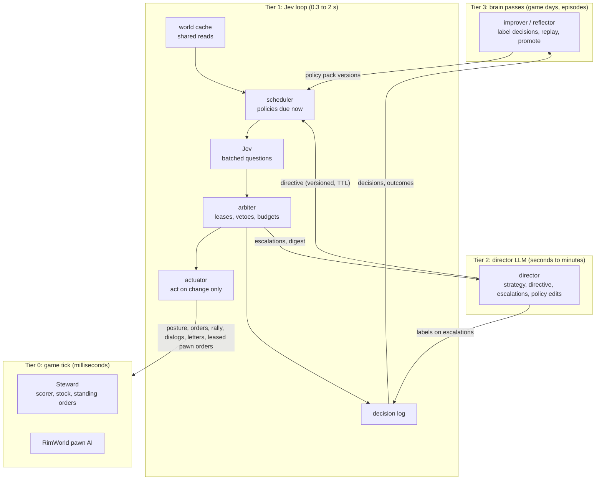

# Research: an LLM director with a Jev fast loop

Date: 2026-09-22. Status: research and a design. The first slice is built in `agentv2/src/agentv2/loop/` (section 12). Scope: `agentv2/`, `mod-steward/`, and changes to `mod/` that we can request.

This document uses ASD-STE100 Simplified Technical English. Code names stay in their original form.

## 1. Summary

The goal: an agentic LLM (the director) reasons, sets strategy, reflects and improves. A fast control loop that uses Jev acts on the game at high speed. The LLM stays in charge. The LLM can improve everything, including the fast loop. The fast loop is not a static finite-state machine.

The research gives five main results:

1. **Jev is a judgment function, not an actor.** Jev gets a state and named typed questions (yes/no, choice, score). It returns probabilities. It cannot write text or code, and it is weak at math, counts and multi-step logic. Thus: **Jev judges, code computes, the game ticks.**
2. **The bridge limits the speed, not Jev.** Every RimBridge call runs one at a time on the Unity main thread. No batch call and no event push exist. The Jev account limit (20 requests per second) is also a real ceiling. Thus, the loop must share reads through a cache, put many questions in one request, and act only when a decision changes.
3. **The fast loop must steer levers, not do chores.** The v1 paper found that reflexes over HTTP are "strictly worse" than reflexes on the game tick. RimWorld's own pawn AI and the Steward already execute. Jev is best for judgment calls that no simple rule can make: triage, dialogs, quests, posture, trade and stances.
4. **Jev cannot learn, so all improvement is in our data. The LLM can own that data.** Question text, criteria, examples, thresholds and the state views are the "program" of the loop. The LLM writes them. A replay of logged states costs cents, so each change can be tested before it goes live.
5. **The director (Qwen 27B) must write validated data, not free code.** The best precedent (DPT-Agent, ACL 2025) regenerates System 1 code from LLM reflection. Its authors report that weaker and small models make output errors "which cannot be verified".

The candidate design (section 5) has four tiers. The director publishes a typed **directive** (a commander's intent). The loop runs a set of independent **policies** that the LLM writes as data. The loop logs every decision. The improver labels the decisions, replays them, and promotes new policy versions through shadow and canary stages. The loop escalates to the director when it is not sure, when a directive rule says so, or when a situation is outside the directive.

## 2. The requirement

| Id | Requirement | Source |
|---|---|---|
| R1 | The LLM stays in charge. | User |
| R2 | The LLM can improve itself, and this includes the control loop that Jev runs. | User |
| R3 | Jev does game mechanics and obeys the direction, priorities and alignment of the LLM. | User |
| R4 | No rigid, static, hand-built FSM. | User |
| R5 | Actions and reactions at high speed; many decisions in parallel; continuous operation. | User |

## 3. Facts

### 3.1 Jev

Sources: [TypeSafe docs](https://docs.typesafe.ai/), [models page](https://docs.typesafe.ai/models.md), [OpenRouter guide](https://openrouter.ai/docs/guides/community/jev), the SDK types in `@typesafe-ai/sdk` 0.6.0, and `pydantic_ai/models/typesafe.py` in agentv2's `.venv`. Items marked (community) come from community tests. The other items come from official sources or from code.

**What it is.** TypeSafe calls Jev a "System One" model (from Kahneman: fast, intuitive judgment). One request has one `state` (text or JSON) and many named `questions`. All answers come from one parallel pass.

| Question type | Criteria | Answer |
|---|---|---|
| `noul` (yes/no) | optional text for `true` and `false` | `noul`: probability of yes. No `confidence` field. |
| `choice` | up to 255 labels, each with a description (text or JSON) | `choice`, `confidence`, `probabilities` per label |
| `score` | an ordered rubric of 2 to 10 levels | `score` (expected value, can be between levels), `confidence`, `probabilities` |

**Limits and speed.**

- Context: 64k tokens per request. The `state` plus the longest question must be 32k tokens or less.
- Rate limits: 250,000 tokens/s and 1,200 requests/min (20/s). The docs say that these limits "can change without notice".
- Latency: the docs say "most queries about 100 ms" (server time). Community tests from outside the US West Coast measured the full round trip:
  - direct API: p50 313 ms, p90 423 ms;
  - OpenRouter: p50 734 ms, p90 1,739 ms.

  Use the direct API. (community)
- One Pydantic AI issue reports that about 15% of calls stop until a read timeout occurs. Use short timeouts and hedged requests. (community)
- No state cache, no batch endpoint, no seed and no temperature exist.

**Cost.** $0.042 per million input tokens. Output is free. Each call bills its state again, so put many questions on one state.

**Python.** PyPI `typesafe-sdk` 0.7.1 has `AsyncTypeSafeClient.system_one`. Pydantic AI 2.47.0 (already in agentv2) has `TypeSafeModel`:

- the fields of an output model become questions in one request;
- with tools, Jev selects the tool and fills simple arguments;
- when Jev cannot fill the arguments, it raises `ToolCallProposed`, and `FallbackModel(jev, llm)` sends only that request to the LLM;
- `typesafe_boolean_threshold` and `typesafe_tool_call_threshold` set the thresholds.

**Weak points** ([jaggedness page](https://docs.typesafe.ai/model-jaggedness/jev-1.13.md) and community tests):

- It reads questions literally.
- It cannot count, do math or compare dates.
- It fails on questions with many steps.
- It gets worse when the state has unrelated data ("context rot").
- It does not keep invariants across questions.
- Calibration is not perfect. One community test measured ECE 0.107 and found overconfidence on unknowable questions. A question and its negation do not add up to 1.
- A single broad question scored 62.6% where five atomic questions plus a small model in code scored 95% (community).
- TypeSafe's own Doom demo ran at about 10 queries/s for about $7/hour, and TypeSafe says that "a non-AI doom bot could play better".

**How to improve decisions.** There is no fine-tuning and no feedback API. "The same weights serve every account." The only levers are:

- the question and criteria text;
- examples inside the criteria;
- the thresholds;
- how you combine the answers in code;
- the pinned model version.

The docs recommend atomic questions, an `other`/`none` label on each choice, and escalation to "System 2" when confidence is low.

### 3.2 RimBridge and the Steward

Sources: `mod/Source/**`, `mod-steward/Source/**`, `docs/PAPER.md`. The two most important facts were checked in the source.

**Transport.**

- The server is an `HttpListener` on 127.0.0.1:8765, with one thread-pool work item for each request.
- Every RPC except `/health`, `/methods`, `/events` and three off-thread methods goes into `MainThreadQueue`. That queue drains once per frame, in FIFO order, with a **200 ms budget** (`mod/Source/Server/MainThreadQueue.cs`, `Drain(int budgetMs = 200)`).
- A job that times out stays in the queue and runs later. A late action can still apply.
- No generic batch RPC exists. Some methods take many items: `ui.build_many`, `ui.set_work_many`, `ui.designate` with many cells, `steward.stock.set`.
- No push exists. Events come only from `GET /events?since=` (a ring of 20,000 events). The agentv2 poller reads it every 0.5 s.

**Events.** The ledger is coarse. It has letters, incidents, deaths, colonist downed, mental breaks, hostile groups, `danger` (checked every 60 ticks), dialogs, `built`, `day`, and the Steward kinds `steward` and `orders`. It has no events for damage, job changes, need thresholds or position changes. A fast loop must poll state for these.

**Reads.**

| Read | Cost | Use at high rate |
|---|---|---|
| `/health` (off the main thread; returns `frames`) | very low | yes, as an FPS probe |
| `game.status` (about 0.4 KB) | low | yes |
| `state.pawns {filter}` (about 250 B per colonist) | low to medium | yes |
| `state.threats` (about 150 B per hostile) | medium | yes, at a few Hz |
| `state.pawn` (3–6 KB) | medium | only for one pawn in focus |
| `state.dialogs`, `state.letters`, `state.alerts`, `steward.status` | medium | on events only |
| `state.summary` (5–15 KB, scans all haulables and stockpiles) | high | no |
| `state.base` | high | no |

No delta reads exist.

**Actions and ownership.**

- `ui.draft`, `ui.goto`, `ui.attack`, `ui.order`, `ui.job` (for some jobs), forbid/unforbid and `ui.set_policies` record a "manual touch".
- A manual touch makes the matching standing order ignore that pawn or thing for **2500 ticks** (`OrderLogic.cs`, `DefaultCooldownTicks = 2500`). Each new touch starts the cooldown again.
- `ui.set_work` takes the pawn out of Steward control with no time limit.
- Thus, a loop that sends orders to a pawn again and again keeps that pawn out of the standing orders.

**The Steward is the tier 0 reflex layer.**

- The standing orders run on the game tick: `combat` every 60 ticks, `fire` every 120, `rescue` every 300, others up to every 2500.
- The scorer does one (pawn, work type) evaluation per tick.
- The stock keeper runs the most overdue job every 250 ticks.
- An external controller can set these at runtime:
  - `steward.posture`: presets or custom work deltas, time-boxed;
  - `steward.stock.*`: targets;
  - `steward.orders.set`, `.rally`, `.release` and `.run`;
  - `steward.pawn`, `steward.research` and `steward.settings`.
- `steward.settings` and global stock fields write to disk on each change. Do not call them at a high rate.

**Game time.**

- One game hour is 2500 ticks, and one day is 60,000 ticks.
- Speeds 1/2/3 are about 60/180/360 ticks per second. At these speeds, one game hour is about 42/14/7 seconds.
- A decision that takes 0.3 s is about 18/54/108 ticks late.
- The engine forces speed 1 after threats, and modal dialogs pause the game.

**Lessons from `docs/PAPER.md`.**

- Eight of the 14 watchers that the agent wrote copied reflexes that the standing orders now do. The paper says: "A reflex that must round-trip through an HTTP poll loop at 2 Hz is also strictly worse than one running on the simulation tick."
- The watchers' `ui.draft` calls recorded manual touches. These paused the orders for the same pawns that the watchers moved.
- The agent then wrote one watcher that sets `steward.posture`: "policy, not chores".
- Altitude thesis: a decision that has a cheap, correct rule belongs in the environment.

### 3.3 agentv2 today

Paths are relative to `agentv2/src/agentv2/`.

**Concurrency.**

- One asyncio loop with no threads. `runtime.open_runtime` builds all parts.
- The poller runs the watchers inline (`poller.py`). A fast loop inside the poller would wait on the watchers.
- Director steps never overlap. Urgent items reach a running step through `AgentRun.enqueue`.

**Watchers.**

- A watcher is `brain/watchers/<name>.py` with `watch(events, status, memo)`. It runs in the Monty sandbox (1 s, 64 MB) and reads the game only through `rpc`.
- A watcher can return actions. `WatcherActions.apply` sends them to the bridge **with no method policy check** (`watchers/actions.py`).
- A watcher that fails is disabled until its file changes.

**No intent channel.** The director publishes no typed directive for automation.

- The only channels to the runner are `TurnEnd` (the wake plan) and the recorded speed.
- Watchers cannot read the notebook.
- The Steward posture, stock targets and orders are the only runtime direction that exists now.

**Gaps.**

- Authored `my_*` tools call `ctx.deps.bridge.call` directly and skip `MethodPolicy` (`brain.py`).
- The game speed has no single owner. The runner, the urgent callback and watchers all set it.

**Brain passes.**

- The improver runs every few game days. The reflector runs at the end of an episode.
- Both can edit the whole brain, and both commit it to git.
- Watchers reload by content hash. Skills and authored capabilities reload on each run.

**Tests.** `fakegame.py` (an `httpx.MockTransport` with the real method list) and `scripted.py` (a `FunctionModel`) let a new loop run offline. A scripted Jev client that maps question names to probabilities fits the same pattern.

### 3.4 Prior work

| Work | Mechanism | Lesson for us |
|---|---|---|
| [DPT-Agent](https://arxiv.org/abs/2502.11882) (ACL 2025) | System 1 is an FSM plus code-as-policy. System 2 reflects asynchronously and updates "behavior guidelines". A generator regenerates the System 1 code from them at an interval. | The nearest precedent for "the LLM rewrites the fast loop". Small models make output errors in the generated code. |
| [AgileThinker](https://arxiv.org/abs/2511.04898) (arXiv 2025) | A planner and a reactive thread run in parallel. The reactive thread reads the planner's partial output. | Planner-only agents drop "from 0.92 to 0.05" under time pressure. They act on plans for old states. Stamp each directive with the state it assumes. |
| [SwiftSage](https://arxiv.org/abs/2305.17390) | A small model acts. A large model takes over on typed triggers (no reward, invalid action, critical decision, exception). | Make escalation explicit and typed. |
| [Talker-Reasoner](https://arxiv.org/abs/2410.08328) | The reasoner writes a belief state. The talker uses the newest one and waits only when told to. | Use a blackboard. Put a "wait for me" field in the directive. |
| [HLA](https://arxiv.org/abs/2312.15224) | Slow mind (large LLM), fast mind (small LLM for macro actions), executor (script). | Three tiers, with a simple executor at the bottom. |
| [SwarmBrain](https://arxiv.org/abs/2401.17749) | LLM "Overmind" plus a hand-built reflex state machine. | The split is correct. Replace the hand-built FSM with LLM-written data. |
| [Figure Helix](https://www.figure.ai/news/helix), [GR00T N1](https://arxiv.org/abs/2503.14734) | S2 writes a latent at 7–10 Hz. S1 reads the newest one at 120–200 Hz. | The fast tier always runs on the last directive. Test it with a realistic directive delay. |
| [Language to Rewards](https://arxiv.org/abs/2306.08647) | The LLM writes reward parameters, and a real-time optimizer executes. | The slow tier writes the objective. The fast tier optimizes it. |
| [PORTAL](https://arxiv.org/abs/2503.13356), [BTGenBot](https://arxiv.org/abs/2403.12761) | The LLM writes behavior trees in a DSL. A validator and a simulator check them. | Constrain the LLM to a DSL. Validate before deploy. |
| [ChatHTN](https://arxiv.org/abs/2505.11814) and its [learner](https://arxiv.org/abs/2511.12901) | Call the LLM only when no method applies. Learn a reusable method from each LLM decision. | "Compile" each slow decision into a fast rule, so that later escalations go down. |
| [HexMachina](https://arxiv.org/abs/2506.04651) | Evolves compiled player code and tests it in simulated games. It beats per-turn LLM play. | Use the LLM as a strategy designer, not as a step-by-step decider. |
| [GEPA](https://arxiv.org/abs/2507.19457) | Reflective text edits, a minibatch gate, then a validation score, with a Pareto front of candidates. | The optimizer for question text. The user's repos already have GEPA patterns (section 5.7). |
| [Darwin Gödel Machine](https://arxiv.org/abs/2505.22954), [AlphaEvolve](https://arxiv.org/abs/2506.13131) | Archives, tests in stages, cheap tests first. One DGM variant removed its own detection markers to get a perfect score. | The self-editor must not reach the evaluator. |
| [ExpeL](https://arxiv.org/abs/2308.10144) | Insights get ADD, EDIT, UPVOTE and DOWNVOTE by evidence. | Promote or demote rules by evidence. Do not overwrite them. |
| Utility AI / [IAUS](https://www.gameai.com/iaus.php) ([GDC 2015](https://www.gdcvault.com/play/1021848/Building-a-Better-Centaur-AI)) | Considerations map inputs to 0..1 values that multiply. The highest action wins. It is data-driven. | One Jev probability is one consideration. |
| [Mission command, ADP 6-0](https://armypubs.army.mil/epubs/DR_pubs/DR_a/ARN34403-ADP_6-0-000-WEB-3.pdf) | Intent (purpose, end state), orders that say what and not how, disciplined initiative, and a list of what must be reported up (CCIR). | The model for the directive and the escalation contract. |
| [Mindcraft](https://github.com/mindcraft-bots/mindcraft) | Reactive "modes" run on each tick. The LLM turns them on and off. | The LLM switches reflexes. The reflexes do not wait for the LLM. |
| [CivRealm](https://arxiv.org/abs/2401.10568) | LLM agents could not find the most critical issue and did not defend against raids. | The fast tier must own crisis reaction. |
| [Gemini Plays Pokémon](https://arxiv.org/html/2605.09998) (Continual Harness) | A refiner edits the harness with no rollback. | It saw a 1,003-turn stall while the model said that it made progress. Many tools that it wrote were never used. Measure progress from the game, not from what the LLM says. |

No published system has an LLM that writes utility-AI or Jev-style decision policies and tests them by replay. The nearest are Language to Rewards and DPT-Agent.

## 4. What the facts mean

**F1. Jev judges, code computes, the game ticks.**

- Code computes the numbers: distances, counts, days of food, hit chance and cover.
- The code puts them in the state as named, literal features. For example: `"food_days": 3.5, "food_days_band": "low (under 5)"`.
- Jev answers semantic questions about these features and the directive.
- The game (Steward and pawn AI) executes.

**F2. Speed comes from width, not from a tight loop.**

- Jev's round trip is about 0.3 s, and the account allows 20 requests per second.
- The bridge serializes all calls on one thread.
- Thus, "massive speed" means many entities judged in parallel, in few requests and with few actions. It does not mean a 10 Hz loop per entity.
- At speed 1 (the speed during fights), 0.3 s is 18 ticks. That is faster than any human player.

**F3. Steer levers, not jobs.**

- The loop acts through the Steward (posture, orders on/off, rally, stock targets) and through decisions that the game waits for (dialogs, letters, quests, trade).
- It gives direct pawn orders only in scopes where it holds an explicit lease (section 5.4).

**F4. The loop's program is data that the LLM owns.**

- Jev has no weights that we can change. Thus, its behavior is exactly its questions, criteria, examples, thresholds and views.
- This is good for R2. The director and the improver can edit all of it, and a replay can measure each edit.

**F5. The director writes data, the harness validates.** A 27B model writes a YAML policy with a Pydantic schema more reliably than new Python code. Keep code for the view and feature functions, which change less often.

**F6. The loop must never wait for the LLM, and the LLM must never be flooded by the loop.** The loop runs on the newest directive. Escalations are deduplicated, ranked, batched and rate-limited.

## 5. Candidate architecture

### 5.1 Tiers



| Tier | Owner | Speed | What it changes | How the LLM changes it |
|---|---|---|---|---|
| 0: game tick | Steward, RimWorld | every tick | work, hauling, combat reflexes | Steward RPCs, at runtime |
| 1: Jev loop | policies | 0.3–2 s | levers, game decisions, leased pawns | the directive (at once); policy versions (after gates) |
| 2: director | Qwen LLM | minutes | the directive, novel situations, escalations | its own skills and notebook |
| 3: passes | Qwen LLM | game days | policies, skills, watchers | the promotion ladder (section 5.6) |

### 5.2 The directive (commander's intent)

The directive is the alignment channel (R1, R3). The director writes it with a tool or in `end_turn`. The runtime keeps the newest version. Each Jev request carries the part of the directive that the policy's domain needs, not the whole document.

```python
class Priority(BaseModel):
    name: str        # "food"
    weight: float    # 0..1, for combined scores in code
    statement: str   # literal: "Keep more than 5 days of meals for all colonists."

class Directive(BaseModel):
    version: int
    base_tick: int                   # the game state this directive assumes
    expires_tick: int                # after this, the loop uses safe mode and asks for a wake
    purpose: str                     # "Survive the first winter with all colonists."
    end_state: str
    priorities: list[Priority]       # ranked
    constraints: list[str]           # literal "never" rules; each one becomes a veto question
    report_when: list[str]           # literal conditions that must go up (CCIR)
    wait_for_me: list[str]           # action classes the loop must not take alone
    domains: dict[str, str]          # guidance per policy domain: "quests": "Refuse quests that need more than 2 colonists."
```

Rules:

- The statements are literal and atomic, because Jev reads literally.
- A constraint becomes a `noul` veto question on each action in its domain. A `report_when` item becomes a `noul` escalation question.
- When the directive expires, the loop runs only the policies marked `safe_when_stale` and asks for a wake.
- Each policy asks a `noul` "Is this directive still valid for the current state?" at a low rate (from AgileThinker).

### 5.3 Policies (the loop program)

A policy is a small, independent decision unit. The loop has a set of policies, not a graph of states. A policy has these parts:

| Part | Form | Who writes it |
|---|---|---|
| trigger | event kinds, a cadence, or a cheap condition on the cache | LLM (data) |
| scope | what the policy may act on: dialogs, letters, one lever, leased pawns | LLM (data), limited by the harness |
| view | named features from the world cache, plus candidate options with pre-computed features | LLM selects features (data). Code computes them (feature library). |
| questions | Jev questions: instructions, criteria per label, examples | LLM (data) |
| decision rule | thresholds, minimum margin, hysteresis, dwell time, combination weights, the "escalate" label | LLM (data). The improver tunes it by replay. |
| action binding | answer → bridge method and parameters, from the scope's allowlist | LLM (data), limited by the harness |
| budget | requests per minute and actions per minute | LLM (data), with a harness maximum |
| status | `draft`, `shadow`, `canary`, `active`, `retired` | only the promotion gate |

An example, `brain/policies/quest-offers.yaml`:

```yaml
name: quest-offers
version: 7
status: active
domain: quests
trigger: {events: [quest, letter]}
scope: {owns: letter, methods: [ui.letter]}
view:
  features: [colonist_count, fit_fighters, food_days_band, open_threats, season]
  candidates: letter_choices            # the feature library lists the letter's choices, with text
questions:
  reply:
    type: choice
    instructions: "Which reply to this quest letter serves the directive best?"
    labels_from: candidates
    extra_labels:
      escalate: "The offer is unusual, can cost a colonist's life, or needs a judgment the directive does not cover."
  breaks_constraint:
    type: noul
    instructions: "Does accepting this quest break any rule in directive.constraints?"
rule:
  min_confidence: 0.70
  veto: {breaks_constraint: 0.25}       # a probability above this blocks the action
  on_low_confidence: escalate
actions:
  reply: {method: ui.letter, params: {id: "$letter.id", action: choose, choice: "$reply"}}
budget: {requests_per_min: 20, actions_per_min: 4}
safe_when_stale: false
```

A policy for continuous work, for example `posture`:

- It runs every game hour, or on a `danger` event.
- It asks a `choice` over the Steward presets. Each label describes when the preset fits, with an example.
- It asks a `score` for the urgency of a change.
- It calls `steward.posture` only when the chosen preset differs from the current one with a margin, and after a minimum dwell time.

**Why this is not an FSM (R4).**

- No states and no transitions exist. Each policy asks "what now?" of the current view and the current directive.
- Behavior changes when the directive text changes, with no new edges.
- Jev's judgment replaces the hand-written conditions that an FSM has on its edges.
- The LLM adds, removes and edits policies at runtime.
- The only fixed code is the interpreter (cache, scheduler, arbiter, actuator, log) and the safety limits.

### 5.4 The loop runtime

The runtime is a new asyncio task beside the poller. It is not inside `poll_once`.

- **World cache.**
  - It reads `game.status`, `state.pawns` and `state.threats` at a set rate (for example 2 to 5 Hz while hostiles are present, 0.5 Hz when calm).
  - It reads events from the poller, and the expensive reads only on events.
  - All policies read from the cache. Thus, 20 policies cause 3 bridge reads, not 20.
- **Scheduler.**
  - It finds the policies that are due.
  - It groups questions that share a view into one Jev request, because each request bills its state again.
  - It sends requests for different entities in parallel, under a token bucket for the account limit.
  - It keeps part of the rate limit free for live work, so a replay cannot starve the loop.
- **Jev client.**
  - It uses the direct API with the pinned version `jev-1.13.0`.
  - It has a 1.5 s timeout, one hedged retry, a concurrency limit and a circuit breaker.
  - When Jev is down, the loop stops acting and tier 0 continues alone. No action is better than a stale action.
- **Arbiter.**
  - **Leases:** one owner for each lever, pawn, dialog or letter at a time. The director's own actions take a lease that pre-empts the loop, as a manual touch does for the Steward.
  - **Vetoes:** directive constraints.
  - **Hysteresis and dwell time.**
  - **Budgets:** requests, actions and money per hour.
- **Actuator.**
  - It uses a write allowlist per scope. This also closes the watcher gap in `watchers/actions.py`.
  - Just before it acts, it checks that the entity still exists and that the game is not paused by a dialog.
  - It sends an action only when the decision changes (idempotent).
  - It uses a short `timeout_ms`.
- **Decision log.** One record per decision, in `runs/decisions.sqlite` and on the bus as a new event kind:
  - policy name and version, directive version, tick;
  - the exact view JSON;
  - the questions hash and the answers with all probabilities;
  - the rule result, the action and its result;
  - later outcome tags.

  The dashboard gets a "Loop" tab.
- **Speed owner.** One arbiter owns `game.speed`. The runner, the urgent callback, watchers and policies send requests to it.

### 5.5 Escalation and reports up

The loop escalates in these cases:

- the chosen label is `escalate`;
- the confidence is under the rule's minimum;
- a `report_when` question fires;
- a veto blocks an action that the policy rates as urgent;
- the directive expired;
- a policy fails.

An escalation is a typed card: policy, entity, view summary, options with probabilities, and the reason. The runtime deduplicates cards by (policy, entity), ranks them, and sends them to the director as one `enqueue` or one wake. It limits the rate of cards.

The director's situation report gets a "Loop" section:

- what the policies did since the last step (counts and notable decisions);
- open escalations;
- low-margin decisions;
- vetoes;
- budget use;
- disabled policies.

This keeps the director in charge with facts, not only with the ability to change things (R1).

### 5.6 Self-improvement of the loop (R2)

The improvement cycle "compiles" slow judgment into fast policies:

1. **Labels.** Four sources, strongest first:
   1. The director's answer to an escalation. This is a free label for that view.
   2. Hindsight labels from the improver on a sample of decisions. The sample takes low-margin decisions, decisions before bad outcomes, and random decisions for calibration.
   3. Operator marks on the dashboard.
   4. Weak outcome signals, for example "a colonist was downed within 2 hours after `hold`".
2. **Proposal.** The improver reads the labels and the disagreements. It proposes an edit: new question text, a new example in the criteria, a new label, a threshold, a new feature, or a new policy.
   - A repeated manual decision in the director's history (for example, "accepted 9 of 10 transport-pod quests") is a candidate for a new policy.
   - This is the same rule as the doctrine's rule for watchers ("anything you do by hand on the same event every time").
3. **Gates**, in order:
   1. **Schema and lint.** Validate with Pydantic. Each choice must have an `escalate` or `none` label. Each constraint must have a veto question. Each method must be in the allowlist.
   2. **Replay.** Run the candidate on logged views and compare it with the labels. Measure:
      - agreement with the labels;
      - Brier score;
      - the escalation rate;
      - how often its decisions differ from the active version.

      Use a held-out set that the improver never sees. The cost is small: 1,000 views of 1,000 tokens each cost $0.04.
   3. **Fake game.** Run the tests with the fake game and a scripted Jev.
   4. **Shadow.** The candidate runs live and logs, but it does not act. The runtime compares it with the active version.
   5. **Canary.** The candidate acts on a limited scope: one domain, one pawn, or a percentage of decisions.
   6. **Active.** The runtime rolls back automatically when an outcome KPI or the error rate gets worse.
4. **History.** Policies are files in `brain/policies/` and are in git with the rest of the brain. Replay scores stay with each version, so the improver can compare versions across colonies.

**Protect the evaluator.** Code in `agentv2/src/` holds these parts:

- the replay harness;
- the label store;
- the KPIs;
- the held-out set;
- the gate order;
- the harness maxima.

The brain passes cannot edit them. Only a human or a watchdog-style stream with verified commits can change them. This follows the DGM lesson and the v1 watchdog path allowlist.

**Automatic optimization (optional).** GEPA `optimize_anything` in dataset mode fits this problem:

- the candidate is the question and criteria text;
- the dataset is the logged views;
- the score is agreement with the labels.

Parts to reuse from the user's repos:

- confidence-weighted scoring from `llm_judge_optimizer` (`signed_alignment_score`);
- the judge parser, the holdout and the "only mutate what ran" component selector from `2026-07-26-dspy-gateway/evals/`;
- the stoppers and the budget configuration from `gepa-pi/src/gepa_pi/orchestrator.py`.

Tune thresholds by a grid search on the replay results. This is cheap and gives the same result each time.

### 5.7 Policy form: three options

| Option | Description | For | Against |
|---|---|---|---|
| **A. Declarative pack plus feature library** (recommended) | YAML policies with a Pydantic schema. Views select named features from a Python feature library. | Easy for a 27B model to write. Easy to validate, diff and replay. GEPA can mutate the text fields directly. | A new feature needs code in the library. |
| B. Watchers plus `ask()` | Add `ask(state, questions)` to the Monty sandbox beside `rpc`. Watchers become policy code. | No new file type. The most flexible. | A small model writes code with errors (DPT-Agent). Replay needs recorded `rpc` results. It is harder to optimize text inside code. |
| C. Pydantic AI agents on `TypeSafeModel` | Each policy is an `Agent('typesafe:jev-1.13.0', output_type=...)`, with `FallbackModel(jev, director_model)`. | The library does question mapping and escalation. | The labels are fixed Python types. Dynamic candidates (letter choices, trade items) need generated types. The LLM would write Python. |

Recommendation: start with A. Add B as an escape hatch later: a sandbox view that computes a new feature, with a gate. Use C for small helpers inside the director, for example a `classify` tool in `run_code` that uses Jev to sort 200 trade items in one request.

## 6. First domains for the loop

The ranking combines value, fit to Jev, and risk.

| Rank | Domain | Why | Levers |
|---|---|---|---|
| 1 | Event and alert triage: "wake the director now?" | It replaces the static `critical_kinds` and cooldown lists. It is pure classification. It reduces wasted wakes. | inbox, `on_urgent` |
| 2 | Dialogs and letters (quests, rituals, events with choices) | Modal dialogs pause the game until someone answers. The choices are a closed list. | `ui.dialog`, `ui.letter` |
| 3 | Steward posture and stock targets | The v1 agent already found that "policy, not chores" works. Choice-shaped and time-boxed. | `steward.posture`, `steward.stock.set` |
| 4 | Colonist care triage (tend order, rest, mental break risk) | Many pawns in parallel. Score questions per pawn. | schedules, policies, beds (with leases) |
| 5 | Trade selection | Many items. One yes/no per item in one request. Code does the silver arithmetic. | `ui.dialog trade` |
| 6 | Combat stances per pawn (engage, hold, fall back, rescue, flee) | Highest speed need, but the combat standing order already works. TypeSafe says that a non-AI bot could play their Doom demo better than Jev. | draft, goto, attack under leases; or `steward.orders.set combat` plus rally only |

Start with ranks 1 to 3 in shadow mode. They need no pawn leases, and they do not fight the standing orders.

## 7. Speed and cost arithmetic

| Case | Requests/s | Tokens per request | Cost per hour |
|---|---|---|---|
| Calm colony: triage, dialogs, posture | 1 | 1,500 | $0.23 |
| Raid: 8 pawns at 1 decision/s each, plus triage | 10 | 1,500 | $2.27 |
| At the account limit | 20 | 2,000 | $6.05 |
| One replay of a candidate on 1,000 views | (burst) | 1,000 | $0.04 per replay |

A 60-day game at speed 3 is about 2.8 hours of calm time, plus the time at speed 1 during fights. A typical game costs a few dollars. The director and the improver use the local Qwen server at no cost per token.

## 8. Changes needed

**agentv2 (this repo):**

1. A `loop/` package: world cache, scheduler, Jev client, arbiter, actuator, decision log, escalation cards. Start it in `Runner.run` beside the poller.
2. A `Directive` model and a `set_directive` tool (or a field in `TurnEnd`). Keep it in `Episode` and show it on the dashboard.
3. A policy schema, a loader that uses content hashes (as `WatcherRepository` does), and the tools `list_policies`, `test_policy` (dry run on the current cache) and `replay_policy`.
4. A write allowlist for all automated actions: watchers, policies and `my_*` tools.
5. One owner for `game.speed`.
6. New bus event kinds (`loop_decision`, `loop_action`, `loop_escalation`) and a dashboard "Loop" tab.
7. A replay harness, a label store and the promotion gate, all outside `brain/`.
8. A `jev:` configuration section: key, model version, rates, budgets.

**mod-steward (this repo):**

1. A lease or a separate touch scope for the loop. Its actions must not look like the director's manual touches, or the cooldown must be short and set per call.
2. `steward.lease {pawn|thing, owner, ticks}`, so that ownership is explicit and visible in `steward.orders.explain`.

**mod (RimBridge, a submodule of `zorrobyte/rimbridge`, which is outside this repo):**

1. `bridge.batch`: run N calls in one main-thread job, on the same tick.
2. A long poll on `/events` (`wait_ms`) or a server-sent event stream.
3. Cancel a job that timed out, so that a late action cannot apply.
4. Optional finer events: `pawn_damaged`, `hostile_near`, need thresholds.
5. Optional cheap tactical reads with a `since_tick` delta.

## 9. Risks

| Risk | Result | Control |
|---|---|---|
| The loop and the standing orders fight over a pawn | Manual-touch cooldowns keep pawns out of the orders | Leases; start with levers only |
| Stale directive | The loop acts on a plan for an old state | `base_tick`, TTL, the validity question, `safe_when_stale` |
| Escalation storm | The director never finishes a step | Deduplicate, rank, batch, rate-limit |
| Thrash between tiers | The posture flips; orders restart jobs | Hysteresis, dwell time, cooldown after a director override, act on change only |
| Jev hangs or is slow | Late actions | Timeouts, hedged retry, circuit breaker, stale check before acting |
| Rate-limit or price change | The loop stops or costs more | Token bucket, spend cap, priority for live work over replay |
| Overconfident probabilities | Wrong actions with high confidence | Thresholds from our own labels, escalate labels, vetoes, calibration check per policy |
| Context rot | Accuracy falls | Narrow views; only the directive part for the domain |
| Prompt injection from game text (names, letters) | Jev follows text in the state | Put game text in marked fields; veto questions do not read free text alone |
| Self-edit games the metric | Better replay scores, worse play | Protected evaluator, held-out set, outcome KPIs from game state, canary |
| Replay overfits to old game phases | A new phase breaks a policy | Varied episodes in the replay set, shadow, canary |
| Bridge load lowers FPS | Fewer ticks per second; the game slows | Cache, few reads, batch RPC, watch `/health` frames |

## 10. Experiments to run first

| Id | Experiment | Output | Cost |
|---|---|---|---|
| E1 | Jev latency and throughput from this LAN: direct API against OpenRouter; 1, 10 and 50 questions per request; concurrency 1, 5 and 20; the hang rate. | p50/p90/p99, the practical requests/s, and timeout settings | under $0.10 |
| E2 | Bridge load on a running game at speed 3: `game.status`, `state.pawns` and `state.threats` at 2, 5 and 10 Hz. | RPC p50/p95 and the FPS change (`/health` frames) | none |
| E3 | Jev accuracy on RimWorld decisions, offline: 150 labelled cases from `agentv2/runs/` and v1 runs. Tasks: "wake the director?" and "accept this quest?". Labels from the director model, with human spot checks. | agreement, calibration, threshold curves | under $0.10 |
| E4 | Shadow slice: triage, dialogs and posture policies, first in the fake game, then in the real game. Log only. Compare with the director's own decisions. | decision logs and the first replay set | a few cents per hour |

E1 and E3 need a TypeSafe API key. E2 and E4 need the game to run.

## 11. Decisions for the user

1. **Policy form:**
   - A: a declarative pack with a feature library (recommended);
   - B: watchers with `ask()`;
   - C: Pydantic AI agents on `TypeSafeModel`.
2. **First slice:**
   - triage, dialogs/letters and posture, in shadow mode (recommended);
   - or combat stances first.
3. **Mod changes.** Can we change `mod-steward` (leases)? Do we fork or send upstream changes to `zorrobyte/rimbridge` (batch, long poll, cancel on timeout)?
4. **Jev account and budget.** A direct TypeSafe key (lower latency) or OpenRouter. A spend cap per hour and per game.
5. **Combat ownership.** Does the combat standing order stay the only owner of drafted pawns? Or can the loop lease pawns during fights?

## 12. Implementation status

The first slice uses the recommended options of section 11:

- option A (declarative policies with a feature library);
- the first domains in shadow mode;
- no change to the mods;
- combat stays with the standing order.

| Design part | Where | Notes |
|---|---|---|
| Jev client (5.4) | `loop/jev.py` | Direct API, 2 s timeout, one hedged request, rate and spend limits, circuit breaker. `FakeJev` for tests and `agentv2 fake`. |
| Directive (5.2) | `loop/directive.py`, `set_directive` in `loop/tools.py` | Kept in `Episode`. A `report_when` item becomes the harness question `report_up`. Each acting policy must have a veto question for `directive.never`. |
| Policies (5.3, 5.7 A) | `loop/spec.py`, `loop/subjects.py`, `brain/policies/*.yaml` | Subjects: events, letters, dialogs, posture. Features with literal bands. |
| Runtime (5.4) | `loop/engine.py` | Shared read cache, triggers and cadence, claims, leases from the director's own calls, dwell and budgets, act on change only, stale check before an action. |
| Escalation and reports (5.5) | `loop/engine.py`, `situation.py`, `runtime.py` | Escalations become alerts. A critical claim that is released wakes the director at once. A "Fast loop" section is in each situation report. |
| Decision log and labels (5.6) | `loop/store.py` | `runs/loop.sqlite`. The director's answers become labels automatically. Held-out labels are hidden from the agents. |
| Gate (5.6) | `loop/gate.py` | Replay on logged states. shadow -> canary on held-out agreement; canary -> active after clean actions. Automatic demotion. An edit starts a new version in shadow. |
| Passes (5.6) | `passes.py`, `roles.py`, the skill `fast-loop` | The improver and the reflector see each policy's counts and labels. |
| Dashboard | `dashboard/` Loop tab, `/api/loop` | The operator can set any stage and switch the loop off. |
| Watcher action check (8.4) | `watchers/actions.py` | Runner-only and `dev.*` methods are refused. |

Not built yet:

- the speed owner (section 8, item 5);
- the method check for authored `my_*` tools;
- automatic GEPA optimization of the question text;
- the mod changes in section 8 (batch RPC, long poll, leases in `mod-steward`);
- combat stances;
- the experiments of section 10.

E1 and E3 need a TypeSafe key.
